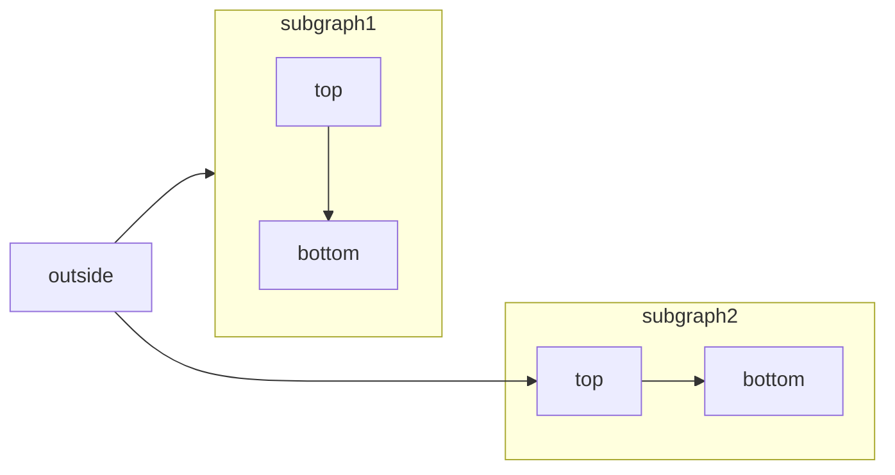

# AI-native

Source: https://mintlify.com/docs/ai-native

Learn how AI enhances reading, writing, and discovering your documentation

When you host your documentation on Mintlify, built-in AI features help your users find answers and your team maintain content more efficiently. Your content provides the context for these AI-native features to improve the experiences of reading, writing, and discovering your documentation.

## What makes your documentation AI-native

### Reading

In addition to reading individual pages, users can chat with the [assistant](/ai/assistant) in your documentation for immediate answers to their questions and links to relevant content. The assistant helps guide users through your product with accurate information from your documentation. Embed the assistant into custom apps with the [API](api-reference/assistant/create-assistant-message) to extend where users can access your documentation.

### Writing

The [agent](/ai/agent) helps you write and maintain documentation. It creates pull requests with proposed changes based on your prompts, pull requests, and Slack threads. Add the agent to your Slack workspace so that anyone on your team can help maintain your documentation by chatting with the agent. Or embed the agent into custom apps via the [API](/api-reference/agent/create-agent-job).

Configure popular tools like [Cursor](/guides/cursor), [Claude Code](/guides/claude-code), and [Windsurf](/guides/windsurf) to reference the Mintlify schema, your style guide, and best practices.

### Discovering

Your site is automatically optimized for AI tools and search engines to help users discover your documentation. All pages are sent as Markdown to AI agents instead of HTML, which helps these tools process your content faster and use fewer tokens. Every page is also available to view as Markdown by appending `.md` to the URL.

Mintlify hosts `llms.txt` and `llms-full.txt` files for your documentation. These industry-standard files help LLMs index your documentation and respond efficiently with relevant information to user queries.

Your documentation site also hosts an MCP server that lets users connect your documentation directly to their AI tools for up to date information about your product directly where they want it.

Full-text search and semantic understanding help users and AI tools find relevant information quickly. Search understands user intent rather than just matching keywords. And if a user encounters a 404 error, your site suggests related pages to help them find what they're looking for. No configuration required.

## Enable AI features

Select any of the following cards for more information.

<CardGroup cols={2}>
  <Card title="Assistant" icon="bot-message-square" href="/ai/assistant">
    Configure the assistant to search external sites or direct people to your support team if it can't answer their questions.
  </Card>

  <Card title="Agent" icon="pen-line" href="/ai/agent">
    Add the agent to your Slack workspace or embed it into custom apps to have it help write and update your documentation.
  </Card>

  <Card title="Contextual menu" icon="sparkles" href="/ai/contextual-menu">
    Add a menu to pages that lets users query AI tools, connect to your MCP server, and copy pages as context with one click.
  </Card>

  <Card title="MCP integration" icon="plug" href="/ai/model-context-protocol">
    Your site has a hosted MCP server that lets users connect your documentation directly to their AI tools. Make your users aware of your MCP server and how to connect to it.
  </Card>
</CardGroup>

# Agent

Source: https://mintlify.com/docs/ai/agent

The agent helps you write and maintain documentation

<Info>
  The agent is available on [Pro and Custom plans](https://mintlify.com/pricing?ref=agent) for anyone with access to your dashboard.
</Info>

The agent creates pull requests with proposed changes to your documentation based on your prompts. When you send a request to the agent, it references your documentation, connected repositories, and Slack messages to create content that follows technical writing best practices and adheres to the Mintlify schema. Access the agent in your Slack workspace or embed it in custom applications with the API.

Use the agent to:

- Write new content based on your prompts, links to pull requests, or Slack threads
- Revise outdated code examples and API references
- Search and update existing content
- Answer questions about your docs and technical writing topics

To get started, add the agent to your Slack workspace and mention it with `@mintlify` in a channel.

## Add the agent to your Slack workspace

<Note>
  If your Slack Workspace Owner requires admin approval to install apps, ask them to approve the Mintlify app before you connect it.
</Note>

1. Navigate to the [agent](https://dashboard.mintlify.com/products/agent) page of your dashboard.
2. Select the **Connect** button.
3. Follow the Slack prompts to add the `mintlify` app to your workspace.
4. Follow the Slack prompts to link your Mintlify account to your Slack workspace.
5. Test that the agent is working and responds when you:
   - Send a direct message to it.
   - Mention it with `@mintlify` in a channel.

## Connect repositories as context

The agent can only access repositories that you connect through the Mintlify GitHub App. Modify which repositories the agent can access in the [GitHub App settings](https://github.com/apps/mintlify/installations/new).

## Embed the agent via API

Use the agent endpoints to [create jobs](/api-reference/agent/create-agent-job), [get a specific job](/api-reference/agent/get-agent-job), and [get all jobs](/api-reference/agent/get-all-jobs).

## Write effective prompts

Think of the agent as a helpful assistant that needs your guidance to complete tasks. Give it clear instructions and context. More focused tasks are easier to complete, so break down complex projects into smaller steps.

Make your prompts specific and outcome-focused. Generic prompts like `@mintlify Improve the onboarding page` apply general best practices, but may not improve content in the specific way that you were picturing.

Try prompts based on outcomes you want your users to achieve or problems that they encounter. For example:

- `@mintlify A lot of users have trouble installing the CLI. Review the onboarding page and update the docs so that users can easily install the CLI`
- `@mintlify Developers keep getting 401 errors when following our authentication guide. Review the auth docs and add clearer examples showing how to properly format the API key`

Use broad prompts for general content maintenance like fixing typos, updating redirects, or renaming a feature throughout your docs. For example:

- `@mintlify Find and fix all typos in the docs`
- `@mintlify change all unordered lists to use * instead of -`

## Specify a subdomain

If you have multiple documentation sites with their own subdomains, include the `subdomain` parameter in your message to specify which subdomain the agent should work on.

Use the format `@mintlify subdomain=<your-subdomain> <your-prompt>` to prompt the agent to work on a specific subdomain.

Examples:

- `@mintlify subdomain=public-docs Add a new section to the quickstart about inviting collaborators based on this PR`: Prompts the agent to update the quickstart only on the `public-docs` subdomain.
- `@mintlify subdomain=customer-docs Update the auth docs for the new authentication method`: Prompts the agent to update the auth docs only on the `customer-docs` subdomain.

## Agent workflows

The agent assists with many different documentation tasks. These workflows show some of the ways you can integrate the agent into your documentation process. Try an approach that fits how your team currently works and adapt it to your specific needs.

### Iterate on a prompt in a Slack thread

Prompt the agent, then continue to mention it with `@mintlify` in the same thread to refine and iterate on the pull request that it creates.

For example: `@mintlify Our quickstart page needs a new section on inviting collaborators`. Then `@mintlify The new section should be called "Inviting collaborators"`. Followed by any other iterations.

### Start with the agent, finish manually

Prompt the agent to begin a project, then check out the branch it creates and finish the task in your local environment or the web editor. The agent can help you get started, then you can take over to complete the task.

For example: `@mintlify Update the quickstart page to include information about inviting collaborators` and then checkout the branch to make any additional changes using your preferred method.

### Update docs when merging feature changes

When you merge a feature pull request, share the PR link with the agent to update relevant docs.

For example: `@mintlify This PR adds a new authentication method. Update the docs to include the new auth flow: [PR link]`.

### Generate release notes from a pull request

Prompt the agent with a specific pull request to generate release notes or changelog updates based on the commit history.

For example: `@mintlify Generate release notes for this PR: [PR link]`.

### Generate code examples

Prompt the agent to generate code examples for features throughout your docs or on specific pages.

For example: `@mintlify Generate a code example to make the authentication method easier to understand`.

### Review existing content

Prompt the agent to review existing content for technical accuracy, style, grammar, or other issues.

For example: `@mintlify Review the API rate limiting section. We changed limits last month`.

### Respond to user feedback

Prompt the agent with feedback from your users to make focused updates to your docs.

For example: `@mintlify Users are getting confused by step 3 in the setup guide. What might be making it unclear?`.

### Automate with the API

Integrate the agent into your existing automation tools to automatically update documentation when code changes occur, trigger content reviews, or sync documentation updates across multiple repositories.

Learn how in the [Auto-update documentation when code is merged](/guides/automate-agent) tutorial.

# Assistant

Source: https://mintlify.com/docs/ai/assistant

Help users succeed with your product and find answers faster

<Info>
  The assistant is automatically enabled on [Pro and Custom plans](https://mintlify.com/pricing?ref=assistant).
</Info>

## About the assistant

The assistant answers questions about your documentation through natural language queries. It is embedded directly in your documentation site, providing users with immediate access to contextual help.

The assistant uses agentic RAG (retrieval-augmented generation) with tool calling powered by Claude Sonnet 4. When users ask questions, the assistant:

- **Searches and retrieves** relevant content from your documentation to provide accurate answers.
- **Cites sources** and provides navigable links to take users directly to referenced pages.
- **Generates copyable code examples** to help users implement solutions from your documentation.

Each message sent to the assistant counts toward your plan's message allowance. If you exceed your allowance, additional messages incur overage charges. You can set spending limits or disable the assistant if you reach your message allowance.

You can view assistant usage through your dashboard to understand user behavior and documentation effectiveness. Export and analyze query data to help identify:

- Frequently asked questions that might need better coverage.
- Content gaps where users struggle to find answers.
- Popular topics that could benefit from additional content.

## Configuring the assistant

The assistant is enabled by default for Pro and Custom plans.

Manage the assistant from your [dashboard](https://dashboard.mintlify.com/products/assistant/settings). Click **Configuration** to enable or disable the assistant, configure response handling, add default questions, and set a spend limit.

<Frame>
  

  
</Frame>

### Enable or disable the assistant

Toggle the assistant status to enable or disable the assistant for your documentation site.

<Frame>
  

  
</Frame>

### Set deflection email

In the response handling section, enable the assistant to redirect unanswered questions to your support team. Specify an email address that the assistant provides to users who ask questions that it cannot answer.

<Frame>
  

  
</Frame>

### Search sites

<Note>
  Site search is in beta. To enable it for your documentation site, [contact our sales team](mailto:gtm@mintlify.com).
</Note>

In the response handling section, configure sites that the assistant can search for additional context when answering questions.

- Sites must be publicly available.
- Sites that require JavaScript to load are not supported.

<Frame>
  

  
</Frame>

Use the following filtering syntax for more precise control over what the assistant can search:

- **Domain-level filtering**
  - `example.com`: Search only the `example.com` domain
  - `docs.example.com`: Search only the `docs.example.com` subdomain
  - `*.example.com`: Search all subdomains of `example.com`
- **Path-level filtering**
  - `docs.example.com/api`: Search all pages under the `/api` subpath
- **Multiple patterns**
  - Add multiple entries to target different sections of sites

### Add sample questions

Help your users start questions with the assistant by adding sample questions. In the search suggestions section, add up to three sample questions.

<Frame>
  

  
</Frame>

### Set a spend limit

Set a spend limit to control what happens if you reach your message allowance. By default, the assistant continues to answer user questions after you reach your message allowance, which incurs overages.

When you reach your spend limit, the assistant is disabled until your message allowance resets.

1. Select the **Billing** tab.

<Frame>
  


</Frame>

2. Set a spend limit for assistant messages beyond your allowance.
3. Set usage alerts to receive an email when you reach a certain percentage of your spend limit.

## Using the assistant

Users can access the assistant in three ways:

- **Keyboard shortcut**: <kbd>Command</kbd> + <kbd>I</kbd> (<kbd>Ctrl</kbd> + <kbd>I</kbd> on Windows)
- **Assistant button** next to the search bar
  
  
- **URLs** with `?assistant=open` appended open the assistant when the page loads. For example, [https://mintlify.com/docs?assistant=open](https://mintlify.com/docs?assistant=open).

Each method opens a chat panel on the right side of your docs. Users can ask any question and the assistant searches your documentation for an answer. If no relevant information is found, the assistant responds that it cannot answer the question.

## Making content AI ingestible

Structure your documentation to help the assistant provide accurate, relevant answers. Clear organization and comprehensive context benefit both human readers and AI understanding.

<Card title="Structure and organization">
  * Use semantic markup.
  * Write descriptive headings for sections.
  * Create a logical information hierarchy.
  * Use consistent formatting across your docs.
  * Include comprehensive metadata in page frontmatter.
  * Break up long blocks of text into shorter paragraphs.
</Card>

<Card title="Context">
  * Define specific terms and acronyms when first introduced.
  * Provide sufficient conceptual content about features and procedures.
  * Include examples and use cases.
  * Cross-reference related topics.
  * Add [hidden pages](/organize/hidden-pages) with additional context that users don't need, but the assistant can reference.
</Card>

## Exporting and analyzing queries

Review and export queries from your dashboard to understand how people interact with your documentation and identify improvement opportunities. Some ways that analyzing queries can help you improve your documentation:

- Identify content gaps where frequent queries receive insufficient answers.
- Discover user behavior patterns and common information needs from themes and patterns in queries.
- Prioritize high-traffic pages for accuracy and quality improvements.

You can explore queries from your [dashboard](https://dashboard.mintlify.com/products/assistant), but to get more powerful insights we recommend exporting a `CSV` file of your queries, responses, and sources to analyze with your preferred AI tool.

1. Navigate to the [assistant page](https://dashboard.mintlify.com/products/assistant) in your dashboard.
2. Select **Export to CSV**.
3. Analyze the exported data using your preferred tool.

<Card title="Sample analysis prompts">
  * Summarize the most common themes of the queries.
  * List any queries that had no sources cited.
  * Find patterns in unsuccessful interactions.
</Card>

## Troubleshooting

<Accordion title="Assistant chat bar not visible">
  If the assistant UI is not visible in specific browsers, you may need to submit a false positive report to [EasyList](https://easylist.to). Browsers that use the EasyList Cookies List like Brave and Comet sometimes block the assistant or other UI elements. The EasyList Cookies List includes a domain-specific rule that hides fixed elements on certain domains to block cookie banners. This rule inadvertently affects legitimate UI components.

Submit a false positive report to [EasyList](https://github.com/easylist/easylist) to request removal of the rule. This resolves the issue for all users once the filter list is updated.
</Accordion>

# Contextual menu

Source: https://mintlify.com/docs/ai/contextual-menu

Add one-click AI integrations to your docs

export const PreviewButton = ({children, href}) => {
return <a href={href} className="text-sm font-medium text-white dark:!text-zinc-950 bg-zinc-900 hover:bg-zinc-700 dark:bg-zinc-100 hover:dark:bg-zinc-300 rounded-full px-3.5 py-1.5 not-prose">
{children}
</a>;
};

The contextual menu provides quick access to AI-optimized content and direct integrations with popular AI tools. When users select the contextual menu on any page, they can copy content as context for AI tools or open conversations in ChatGPT, Claude, Perplexity, or a custom tool of your choice with your documentation already loaded as context.

## Menu options

The contextual menu includes several pre-built options that you can enable by adding their identifier to your configuration.

| Option                  | Identifier   | Description                                                              |
| :---------------------- | :----------- | :----------------------------------------------------------------------- |
| **Copy page**           | `copy`       | Copies the current page as Markdown for pasting as context into AI tools |
| **View as Markdown**    | `view`       | Opens the current page as Markdown                                       |
| **Open in ChatGPT**     | `chatgpt`    | Creates a ChatGPT conversation with the current page as context          |
| **Open in Claude**      | `claude`     | Creates a Claude conversation with the current page as context           |
| **Open in Perplexity**  | `perplexity` | Creates a Perplexity conversation with the current page as context       |
| **Copy MCP server URL** | `mcp`        | Copies your MCP server URL to the clipboard                              |
| **Connect to Cursor**   | `cursor`     | Installs your hosted MCP server in Cursor                                |
| **Connect to VS Code**  | `vscode`     | Installs your hosted MCP server in VS Code                               |

<Frame>
  
</Frame>

## Enabling the contextual menu

Add the `contextual` field to your `docs.json` file and specify which options you want to include.

```json theme={null}
{
  "contextual": {
    "options": [
      "copy",
      "view",
      "chatgpt",
      "claude",
      "perplexity",
      "mcp",
      "cursor",
      "vscode"
    ]
  }
}
```

## Adding custom options

Create custom options in the contextual menu by adding an object to the `options` array. Each custom option requires these properties:

<ResponseField name="title" type="string" required>
  The title of the option.
</ResponseField>

<ResponseField name="description" type="string" required>
  The description of the option. Displayed beneath the title when the contextual menu is expanded.
</ResponseField>

<ResponseField name="icon" type="string" required>
  The icon to display.

Options:

- [Font Awesome icon](https://fontawesome.com/icons) name
- [Lucide icon](https://lucide.dev/icons) name
- JSX-compatible SVG code wrapped in curly braces
- URL to an externally hosted icon
- Path to an icon file in your project

For custom SVG icons:

1. Convert your SVG using the [SVGR converter](https://react-svgr.com/playground/).
2. Paste your SVG code into the SVG input field.
3. Copy the complete `<svg>...</svg>` element from the JSX output field.
4. Wrap the JSX-compatible SVG code in curly braces: `icon={<svg ...> ... </svg>}`.
5. Adjust `height` and `width` as needed.
   </ResponseField>

<ResponseField name="iconType" type="string">
  The [Font Awesome](https://fontawesome.com/icons) icon style. Only used with Font Awesome icons.

Options: `regular`, `solid`, `light`, `thin`, `sharp-solid`, `duotone`, `brands`.
</ResponseField>

<ResponseField name="href" type="string | object" required>
  The href of the option. Use a string for simple links or an object for dynamic links with query parameters.

  <Expandable title="href object">
    <ResponseField name="base" type="string" required>
      The base URL for the option.
    </ResponseField>

    <ResponseField name="query" type="object" required>
      The query parameters for the option.

      <Expandable title="query object">
        <ResponseField name="key" type="string" required>
          The query parameter key.
        </ResponseField>

        <ResponseField name="value" type="string" required>
          The query parameter value. We will replace the following placeholders with the corresponding values:

          * Use `$page` to insert the current page content in Markdown.
          * Use `$path` to insert the current page path.
          * Use `$mcp` to insert the hosted MCP server URL.
        </ResponseField>
      </Expandable>
    </ResponseField>

  </Expandable>
</ResponseField>

Example custom option:

```json {9-14} wrap theme={null}
{
  "contextual": {
    "options": [
      "copy",
      "view",
      "chatgpt",
      "claude",
      "perplexity",
      {
        "title": "Request a feature",
        "description": "Join the discussion on GitHub to request a new feature",
        "icon": "plus",
        "href": "https://github.com/orgs/mintlify/discussions/categories/feature-requests"
      }
    ]
  }
}
```

### Custom option examples

<AccordionGroup>
  <Accordion title="Simple link">
    ```json  theme={null}
    {
      "title": "Request a feature",
      "description": "Join the discussion on GitHub",
      "icon": "plus",
      "href": "https://github.com/orgs/mintlify/discussions/categories/feature-requests"
    }
    ```
  </Accordion>

  <Accordion title="Dynamic link with page content">
    ```json  theme={null}
    {
      "title": "Share on X",
      "description": "Share this page on X",
      "icon": "x",
      "href": {
        "base": "https://x.com/intent/tweet",
        "query": [
          {
          "key": "text",
          "value": "Check out this documentation: $page"
          }
        ]
      }
    }
    ```
  </Accordion>
</AccordionGroup>

# llms.txt

Source: https://mintlify.com/docs/ai/llmstxt

Make your content easier for LLMs to read and index

export const PreviewButton = ({children, href}) => {
return <a href={href} className="text-sm font-medium text-white dark:!text-zinc-950 bg-zinc-900 hover:bg-zinc-700 dark:bg-zinc-100 hover:dark:bg-zinc-300 rounded-full px-3.5 py-1.5 not-prose">
{children}
</a>;
};

The [llms.txt file](https://llmstxt.org) is an industry standard that helps LLMs index content more efficiently, similar to how a sitemap helps search engines. AI tools can use this file to understand your documentation structure and find content relevant to user queries.

Mintlify automatically hosts an `llms.txt` file at the root of your project that lists all available pages in your documentation. This file is always up to date and requires zero maintenance. You can optionally add a custom `llms.txt` file to the root of your project.

View your `llms.txt` by appending `/llms.txt` to your documentation site's URL.

<PreviewButton href="https://mintlify.com/docs/llms.txt">Open the llms.txt for this site.</PreviewButton>

## llms.txt structure

An `llms.txt` file is a plain Markdown file that contains:

- **Site title** as an H1 heading.
- **Structured content sections** with links and a description of each page in your documentation.

Pages are listed alphabetically in the order they appear in your repository, starting from the root directory.

Each page's description comes from the `description` field in its frontmatter. Pages without a `description` field appear in the `llms.txt` file without a description.

```mdx Example llms.txt theme={null}
# Site title

## Docs

- [API](https://example.com/docs/api): Endpoint list and usage
- [Install](https://example.com/docs/install): Setup steps
- [Getting started](https://example.com/docs/start): Intro guide
```

This structured approach allows LLMs to efficiently process your documentation at a high level and locate relevant content for user queries, improving the accuracy and speed of AI-assisted documentation searches.

## llms-full.txt

The `llms-full.txt` file combines your entire documentation site into a single file as context for AI tools and is indexed by LLM traffic.

Mintlify automatically hosts an `llms-full.txt` file at the root of your project. View your `llms-full.txt` by appending `/llms-full.txt` to your documentation site's URL.

<PreviewButton href="https://mintlify.com/docs/llms-full.txt">Open the llms-full.txt for this site.</PreviewButton>

## Custom files

To add a custom `llms.txt` or `llms-full.txt` file, create an `llms.txt` or `llms-full.txt` file at the root of your project. Adding a custom file will override the automatically generated file of the same name. If you delete a custom file, the default file will be used again.

Your custom `llms.txt` or `llms-full.txt` file must have a site title as an H1 heading. Other content is optional. See [Format](https://llmstxt.org/#format) in the `llms.txt` specification for more information on optional sections and best practices.

# Markdown export

Source: https://mintlify.com/docs/ai/markdown-export

Quickly get Markdown versions of pages

export const PreviewButton = ({children, href}) => {
return <a href={href} className="text-sm font-medium text-white dark:!text-zinc-950 bg-zinc-900 hover:bg-zinc-700 dark:bg-zinc-100 hover:dark:bg-zinc-300 rounded-full px-3.5 py-1.5 not-prose">
{children}
</a>;
};

Markdown provides structured text that AI tools can process more efficiently than HTML, which results in better response accuracy, faster processing times, and lower token usage.

Mintlify automatically generates Markdown versions of pages that are optimized for AI tools and external integrations.

## .md URL extension

Add `.md` to any page's URL to view a Markdown version.

<PreviewButton href="https://mintlify.com/docs/ai/markdown-export.md">Open this page as Markdown</PreviewButton>

## Keyboard shortcut

Press <kbd>Command</kbd> + <kbd>C</kbd> (<kbd>Ctrl</kbd> + <kbd>C</kbd> on Windows) to copy a page as Markdown to your clipboard.

# Model Context Protocol

Source: https://mintlify.com/docs/ai/model-context-protocol

Let users access your docs and APIs through their favorite AI tools

export const PreviewButton = ({children, href}) => {
return <a href={href} className="text-sm font-medium text-white dark:!text-zinc-950 bg-zinc-900 hover:bg-zinc-700 dark:bg-zinc-100 hover:dark:bg-zinc-300 rounded-full px-3.5 py-1.5 not-prose">
{children}
</a>;
};

## About MCP servers

The Model Context Protocol (MCP) is an open protocol that creates standardized connections between AI applications and external services, like documentation. Mintlify generates an MCP server from your documentation and OpenAPI specifications, preparing your content for the broader AI ecosystem where any MCP client (like Claude, Cursor, Goose, and others) can connect to your documentation and APIs.

Your MCP server exposes tools for AI applications to search your documentation and interact with your APIs.

## Accessing your MCP server

<Note>
  MCP servers can only be generated for public documentation. Documentation behind end-user authentication cannot be accessed for server generation.
</Note>

Mintlify automatically generates an MCP server for your documentation and hosts it at your documentation URL with the `/mcp` path. For example, Mintlify's MCP server is available at `https://mintlify.com/docs/mcp`.

You can see and copy your MCP server URL in your [dashboard](https://dashboard.mintlify.com/products/mcp).

The `/mcp` path is reserved for hosted MCP servers and cannot be used for other navigation elements.

## Configuring your MCP server

All MCP servers include the `search` tool by default, which allows users to query information from your docs in other tools.

If you have a [Pro or Enterprise plan](https://mintlify.com/pricing?ref=mcp), you can expose endpoints from your OpenAPI specification as MCP tools.

To expose endpoints as MCP tools, use the `mcp` object within the `x-mint` extension at either the file or endpoint level. For example, the Mintlify MCP server includes tools to create assistant chats, get status updates, and trigger updates.

MCP servers follow a security-first approach where API endpoints are not exposed by default. You must explicitly enable endpoints to make them available as MCP tools. Only expose endpoints that are safe for public access through AI tools.

<ResponseField name="mcp" type="object">
  The MCP configuration for the endpoint.

  <Expandable title="MCP">
    <ResponseField name="enabled" type="boolean">
      Whether to expose the endpoint as an MCP tool. Takes precedence over the file-level configuration.
    </ResponseField>

    <ResponseField name="name" type="string">
      The name of the MCP tool.
    </ResponseField>

    <ResponseField name="description" type="string">
      The description of the MCP tool.
    </ResponseField>

  </Expandable>
</ResponseField>

### File-level configuration

Enable MCP for all endpoints by default in an OpenAPI specification file and selectively exclude endpoints:

```json theme={null}
{
  "openapi": "3.1.0",
  "x-mint": {
    "mcp": {
      "enabled": true
    }
  },
  // ...
  "paths": {
    "/api/v1/users": {
      "get": {
        "x-mint": {
          "mcp": {
            "enabled": false // Disables MCP for this endpoint
          }
        }
        // ...
      }
    }
  }
}
```

### Endpoint-level configuration

Enable MCP for specific endpoints:

```json theme={null}
{
  "paths": {
    "/api/v1/users": {
      "get": {
        "x-mint": {
          "mcp": {
            "enabled": true,
            "name": "get-users",
            "description": "Get a list of users"
          }
          // ...
        }
      }
    },
    "/api/v1/delete": {
      "delete": {
        // No `x-mint: mcp` so this endpoint is not exposed as an MCP tool
        // ...
      }
    }
  }
}
```

## Using your MCP server

Your users must connect your MCP server to their preferred AI tools.

1. Make your MCP server URL publicly available.
2. Users copy your MCP server URL and add it to their tools.
3. Users access your documentation and API endpoints through their tools.

These are some of the ways you can help your users connect to your MCP server:

<Tabs>
  <Tab title="Contextual menu">
    Add options in the [contextual menu](/ai/contextual-menu) for your users to connect to your MCP server from any page of your documentation.

    | Option                  | Identifier | Description                                         |
    | :---------------------- | :--------- | :-------------------------------------------------- |
    | **Copy MCP server URL** | `mcp`      | Copies your MCP server URL to the user's clipboard. |
    | **Connect to Cursor**   | `cursor`   | Installs your MCP server in Cursor.                 |
    | **Connect to VS Code**  | `vscode`   | Installs your MCP server in VS Code.                |

  </Tab>

  <Tab title="Claude">
    <Steps>
      <Step title="Get your MCP server URL.">
        Navigate to your [dashboard](https://dashboard.mintlify.com/products/mcp) and find your MCP server URL.
      </Step>

      <Step title="Publish your MCP server URL for your users.">
        Create a guide for your users that includes your MCP server URL and the steps to connect it to Claude.

        1. Navigate to the [Connectors](https://claude.ai/settings/connectors) page in the Claude settings.
        2. Select **Add custom connector**.
        3. Add your MCP server name and URL.
        4. Select **Add**.
        5. When using Claude, select the attachments button (the plus icon).
        6. Select your MCP server.
      </Step>
    </Steps>

    See the [Model Context Protocol documentation](https://modelcontextprotocol.io/docs/tutorials/use-remote-mcp-server#connecting-to-a-remote-mcp-server) for more details.

  </Tab>

  <Tab title="Claude Code">
    <Steps>
      <Step title="Get your MCP server URL.">
        Navigate to your [dashboard](https://dashboard.mintlify.com/products/mcp) and find your MCP server URL.
      </Step>

      <Step title="Publish your MCP server URL for your users.">
        Create a guide for your users that includes your MCP server URL and the command to connect it to Claude Code.

        ```bash  theme={null}
        claude mcp add --transport http <name> <url>
        ```
      </Step>
    </Steps>

    See the [Claude Code documentation](https://docs.anthropic.com/en/docs/claude-code/mcp#installing-mcp-servers) for more details.

  </Tab>

  <Tab title="Cursor">
    <Steps>
      <Step title="Get your MCP server URL.">
        Navigate to your [dashboard](https://dashboard.mintlify.com/products/mcp) and find your MCP server URL.
      </Step>

      <Step title="Publish your MCP server URL for your users.">
        Create a guide for your users that includes your MCP server URL and the steps to connect it to Cursor.

        1. Use <kbd>Command</kbd> + <kbd>Shift</kbd> + <kbd>P</kbd> (<kbd>Ctrl</kbd> + <kbd>Shift</kbd> + <kbd>P</kbd> on Windows) to open the command palette.
        2. Search for "Open MCP settings".
        3. Select **Add custom MCP**. This will open the `mcp.json` file.
        4. In `mcp.json`, configure your server:

        ```json  theme={null}
        {
          "mcpServers": {
            "<your-mcp-server-name>": {
              "url": "<your-mcp-server-url>"
            }
          }
        }
        ```
      </Step>
    </Steps>

    See the [Cursor documentation](https://docs.cursor.com/en/context/mcp#installing-mcp-servers) for more details.

  </Tab>

  <Tab title="VS Code">
    <Steps>
      <Step title="Get your MCP server URL.">
        Navigate to your [dashboard](https://dashboard.mintlify.com/products/mcp) and find your MCP server URL.
      </Step>

      <Step title="Publish your MCP server URL for your users.">
        Create a guide for your users that includes your MCP server URL and the steps to connect it to VS Code.

        1. Create a `.vscode/mcp.json` file.
        2. In `mcp.json`, configure your server:

        ```json  theme={null}
        {
          "servers": {
            "<your-mcp-server-name>": {
              "type": "http",
              "url": "<your-mcp-server-url>"
            }
          }
        }
        ```
      </Step>
    </Steps>

    See the [VS Code documentation](https://code.visualstudio.com/docs/copilot/chat/mcp-servers) for more details.

  </Tab>
</Tabs>

### Example: Connecting to the Mintlify MCP server

Connect to the Mintlify MCP server to interact with the Mintlify API and search our documentation. This will give you more accurate answers about how to use Mintlify in your local environment and demonstrates how you can help your users connect to your MCP server.

<Tabs>
  <Tab title="Contextual menu">
    At the top of this page, select the contextual menu and choose **Connect to Cursor** or **Connect to VS Code** to connect the Mintlify MCP server to the IDE of your choice.
  </Tab>

  <Tab title="Claude">
    To use the Mintlify MCP server with Claude:

    <Steps>
      <Step title="Add the Mintlify MCP server to Claude">
        1. Navigate to the [Connectors](https://claude.ai/settings/connectors) page in the Claude settings.
        2. Select **Add custom connector**.
        3. Add the Mintlify MCP server:

        * Name: `Mintlify`
        * URL: `https://mintlify.com/docs/mcp`

        4. Select **Add**.
      </Step>

      <Step title="Access the MCP server in your chat">
        1. When using Claude, select the attachments button (the plus icon).
        2. Select the Mintlify MCP server.
        3. Ask Claude a question about Mintlify.
      </Step>
    </Steps>

    See the [Model Context Protocol documentation](https://modelcontextprotocol.io/docs/tutorials/use-remote-mcp-server#connecting-to-a-remote-mcp-server) for more details.

  </Tab>

  <Tab title="Claude Code">
    To use the Mintlify MCP server with Claude Code, run the following command:

    ```bash  theme={null}
    claude mcp add --transport http Mintlify https://mintlify.com/docs/mcp
    ```

    Test the connection by running:

    ```bash  theme={null}
    claude mcp list
    ```

    See the [Claude Code documentation](https://docs.anthropic.com/en/docs/claude-code/mcp#installing-mcp-servers) for more details.

  </Tab>

  <Tab title="Cursor">
    <PreviewButton href="cursor://anysphere.cursor-deeplink/mcp/install?name=mintlify&config=eyJ1cmwiOiJodHRwczovL21pbnRsaWZ5LmNvbS9kb2NzL21jcCJ9">Install in Cursor</PreviewButton>

    To connect the Mintlify MCP server to Cursor, click the **Install in Cursor** button. Or to manually connect the MCP server, follow these steps:

    <Steps>
      <Step title="Open MCP settings">
        1. Use <kbd>Command</kbd> + <kbd>Shift</kbd> + <kbd>P</kbd> (<kbd>Ctrl</kbd> + <kbd>Shift</kbd> + <kbd>P</kbd> on Windows) to open the command palette.
        2. Search for "Open MCP settings".
        3. Select **Add custom MCP**. This will open the `mcp.json` file.
      </Step>

      <Step title="Configure the Mintlify MCP server">
        In `mcp.json`, add:

        ```json  theme={null}
        {
          "mcpServers": {
            "Mintlify": {
              "url": "https://mintlify.com/docs/mcp"
            }
          }
        }
        ```
      </Step>

      <Step title="Test the connection">
        In Cursor's chat, ask "What tools do you have available?" Cursor should show the Mintlify MCP server as an available tool.
      </Step>
    </Steps>

    See [Installing MCP servers](https://docs.cursor.com/en/context/mcp#installing-mcp-servers) in the Cursor documentation for more details.

  </Tab>

  <Tab title="VS Code">
    <PreviewButton href="https://vscode.dev/redirect/mcp/install?name=mintlify&config=%7B%22type%22%3A%22http%22%2C%22url%22%3A%22https%3A%2F%2Fmintlify.com%2Fdocs%2Fmcp%22%7D">Install in VS Code</PreviewButton>

    To connect the Mintlify MCP server to VS Code, click the **Install in VS Code** button. Or to manually connect the MCP server, create a `.vscode/mcp.json` file and add:

    ```json  theme={null}
    {
      "servers": {
        "Mintlify": {
          "type": "http",
          "url": "https://mintlify.com/docs/mcp"
        }
      }
    }
    ```

    See the [VS Code documentation](https://code.visualstudio.com/docs/copilot/chat/mcp-servers) for more details.

  </Tab>
</Tabs>

## Authentication

When you enable an API endpoint for MCP, the server includes the authentication requirements defined in your OpenAPI `securitySchemes` and `securityRequirement`. Any keys are handled directly by the tool and not stored or processed by Mintlify.

If a user asks their AI tool to call a protected endpoint, the tool will request the necessary authentication credentials from the user at that moment.

## Monitoring your MCP server

You can view all available MCP tools in the **Available tools** section of the [MCP Server page](https://dashboard.mintlify.com/products/mcp) in your dashboard.

<Frame>
  

  
</Frame>

## Troubleshooting

<AccordionGroup>
  <Accordion title="MCP server only shows search tool">
    If your MCP server only exposes the search tool despite having an OpenAPI specification:

    1. Verify your OpenAPI specification is valid and accessible.
    2. Ensure you've explicitly enabled MCP for specific endpoints using `x-mint.mcp.enabled: true`.
    3. Check your deployment logs for OpenAPI processing errors.

    If OpenAPI processing fails, the server continues with just the search tool to maintain functionality.

  </Accordion>

  <Accordion title="Authentication issues">
    If users report authentication problems:

    1. Check that your OpenAPI specification includes proper `securitySchemes` definitions.
    2. Confirm that enabled endpoints work with the specified authentication methods.

  </Accordion>

  <Accordion title="Tool descriptions missing or unclear">
    If AI tools aren't using your API endpoints effectively:

    1. Add detailed `summary` and `description` fields to your endpoints.
    2. Ensure parameter names and descriptions are self-explanatory.
    3. Use the MCP dashboard to verify how your endpoints appear as tools.

  </Accordion>
</AccordionGroup>

# Adding SDK examples

Source: https://mintlify.com/docs/api-playground/adding-sdk-examples

Display language-specific code samples alongside your API endpoints to show developers how to use your SDKs

If your users interact with your API using an SDK rather than directly through a network request, you can use the `x-codeSamples` extension to add code samples to your OpenAPI document and display them in your OpenAPI pages.

This property can be added to any request method and has the following schema.

<ParamField body="lang" type="string" required>
  The language of the code sample.
</ParamField>

<ParamField body="label" type="string">
  The label for the sample. This is useful when providing multiple examples for a single endpoint.
</ParamField>

<ParamField body="source" type="string" required>
  The source code of the sample.
</ParamField>

Here is an example of code samples for a plant tracking app, which has both a Bash CLI tool and a JavaScript SDK.

```yaml theme={null}
paths:
  /plants:
    get:
      # ...
      x-codeSamples:
        - lang: bash
          label: List all unwatered plants
          source: |
            planter list -u
        - lang: javascript
          label: List all unwatered plants
          source: |
            const planter = require('planter');
            planter.list({ unwatered: true });
        - lang: bash
          label: List all potted plants
          source: |
            planter list -p
        - lang: javascript
          label: List all potted plants
          source: |
            const planter = require('planter');
            planter.list({ potted: true });
```

# Playground

Source: https://mintlify.com/docs/api-playground/asyncapi/playground

Enable users to interact with your websockets

# AsyncAPI setup

Source: https://mintlify.com/docs/api-playground/asyncapi/setup

Create websocket reference pages with AsyncAPI

## Add an AsyncAPI specification file

To begin to create pages for your websockets, make sure you have a valid AsyncAPI schema document in either JSON or YAML format that follows the [AsyncAPI specification](https://www.asyncapi.com/docs/reference/specification/v3.0.0). Your schema must follow the AsyncAPI specification 3.0+.

<Tip>
  To make sure your AsyncAPI schema is valid, you can paste it into the
  [AsyncAPI Studio](https://studio.asyncapi.com/)
</Tip>

## Auto-populate websockets pages

You can add an `asyncapi` field to any tab or group in the navigation of your `docs.json`. This field can contain either the path to an AsyncAPI schema document in your docs repo, the URL of a hosted AsyncAPI schema document, or an array of links to AsyncAPI schema documents. Mintlify will automatically generate a page for each AsyncAPI websocket channel.

**Examples with Tabs:**

<CodeGroup>
  ```json Local File {5} theme={null}
  "navigation": {
    "tabs": [
      {
          "tab": "API Reference",
          "asyncapi": "/path/to/asyncapi.json"
      }
    ]
  }

````

```json Remote URL {5} theme={null}
"navigation": {
  "tabs": [
    {
        "tab": "API Reference",
        "asyncapi": "https://github.com/asyncapi/spec/blob/master/examples/simple-asyncapi.yml"
    }
  ]
}
````

</CodeGroup>

**Examples with Groups:**

```json {8-11} theme={null}
"navigation": {
  "tabs": [
    {
      "tab": "AsyncAPI",
      "groups": [
        {
          "group": "Websockets",
          "asyncapi": {
            "source": "/path/to/asyncapi.json",
            "directory": "api-reference"
          }
        }
      ]
    }
  ]
}
```

<Note>
  The directory field is optional. If not specified, the files will be placed in
  the **api-reference** folder of the docs repo.
</Note>

## Channel page

If you want more control over how you order your channels or if you want to just reference a single channel, you can create an MDX file with the `asyncapi` field in the frontmatter.

```mdx theme={null}
---
title: "Websocket Channel"
asyncapi: "/path/to/asyncapi.json channelName"
---
```

# Complex data types

Source: https://mintlify.com/docs/api-playground/complex-data-types

Describe APIs with flexible schemas, optional properties, and multiple data formats using `oneOf`, `anyOf`, and `allOf` keywords

When your API accepts multiple data formats, has conditional fields, or uses inheritance patterns, OpenAPI's schema composition keywords help you document these flexible structures. Using `oneOf`, `anyOf`, and `allOf`, you can describe APIs that handle different input types or combine multiple schemas into comprehensive data models.

## `oneOf`, `anyOf`, `allOf` keywords

For complex data types, OpenAPI provides keywords for combining schemas:

- `allOf`: Combines multiple schemas (like merging objects or extending a base schema). Functions like an `and` operator.
- `anyOf`: Accepts data matching any of the provided schemas. Functions like an `or` operator.
- `oneOf`: Accepts data matching exactly one of the provided schemas. Functions like an `exclusive-or` operator.

<Warning>Mintlify treats `oneOf` and `anyOf` identically since the practical difference rarely affects using the API.</Warning>

For detailed specifications of these keywords see the [OpenAPI documentation](https://swagger.io/docs/specification/data-models/oneof-anyof-allof-not/).

<Info>The `not` keyword is currently unsupported.</Info>

### Combining schemas with `allOf`

When you use `allOf`, Mintlify performs some preprocessing on your OpenAPI document to display complex combinations in a readable way. For example, when you combine two object schemas with `allOf`, Mintlify combines the properties of both into a single object. This becomes especially useful when leveraging OpenAPI's reusable [components](https://swagger.io/docs/specification/components/).

```yaml theme={null}
org_with_users:
  allOf:
    - $ref: "#/components/schemas/Org"
    - type: object
      properties:
        users:
          type: array
          description: An array containing all users in the organization
# ...
components:
  schemas:
    Org:
      type: object
      properties:
        id:
          type: string
          description: The ID of the organization
```

<ParamField body="org_with_users" type="object">
  <Expandable>
    <ParamField body="id" type="string">
      The ID of the organization
    </ParamField>

    <ParamField body="users" type="object[]">
      An array containing all users in the organization
    </ParamField>

  </Expandable>
</ParamField>

### Providing options with `oneOf` and `anyOf`

When you use `oneOf` or `anyOf`, the options are displayed in a tabbed container. Specify a `title` field in each subschema to give your options names. For example, here's how you might display two different types of delivery addresses:

```yaml theme={null}
delivery_address:
  oneOf:
    - title: StreetAddress
      type: object
      properties:
        address_line_1:
          type: string
          description: The street address of the recipient
        # ...
    - title: POBox
      type: object
      properties:
        box_number:
          type: string
          description: The number of the PO Box
        # ...
```

<ParamField body="delivery_address" type="object">
  <div className="mt-4 rounded-xl border border-gray-100 px-4 pb-4 pt-2 dark:border-white/10">
    <Tabs>
      <Tab title="StreetAddress">
        <ParamField body="address_line_1" type="string">
          The street address of the residence
        </ParamField>
      </Tab>

      <Tab title="POBox">
        <ParamField body="box_number" type="string">
          The number of the PO Box
        </ParamField>
      </Tab>
    </Tabs>

  </div>
</ParamField>

# Managing page visibility

Source: https://mintlify.com/docs/api-playground/managing-page-visibility

Control which endpoints from your OpenAPI specification appear in your documentation navigation

You can control which OpenAPI operations get published as documentation pages and their visibility in navigation. This is useful for internal-only endpoints, deprecated operations, beta features, or endpoints that should be accessible via direct URL but not discoverable through site navigation.

If your pages are autogenerated from an OpenAPI document, you can manage page visibility with the `x-hidden` and `x-excluded` extensions.

## `x-hidden`

The `x-hidden` extension creates a page for an endpoint, but hides it from navigation. The page is only accessible by navigating directly to its URL.

Common use cases for `x-hidden` are:

- Endpoints you want to document, but not promote.
- Pages that you will link to from other content.
- Endpoints for specific users.

## `x-excluded`

The `x-excluded` extension completely excludes an endpoint from your documentation.

Common use cases for `x-excluded` are:

- Internal-only endpoints.
- Deprecated endpoints that you don't want to document.
- Beta features that are not ready for public documentation.

## Implementation

Add the `x-hidden` or `x-excluded` extension under the HTTP method in your OpenAPI specification.

Here are examples of how to use each property in an OpenAPI schema document for an endpoint and a webhook path.

```json {11, 19} theme={null}
"paths": {
  "/plants": {
    "get": {
      "description": "Returns all plants from the store",
      "parameters": { /*...*/ },
      "responses": { /*...*/ }
    }
  },
  "/hidden_plants": {
    "get": {
      "x-hidden": true,
      "description": "Returns all somewhat secret plants from the store",
      "parameters": { /*...*/ },
      "responses": { /*...*/ }
    }
  },
  "/secret_plants": {
    "get": {
      "x-excluded": true,
      "description": "Returns all top secret plants from the store (do not publish this endpoint!)",
      "parameters": { /*...*/ },
      "responses": { /*...*/ }
    }
  }
},
```

```json {9, 15} theme={null}
"webhooks": {
  "/plants_hook": {
    "post": {
      "description": "Webhook for information about a new plant added to the store",
    }
  },
  "/hidden_plants_hook": {
    "post": {
      "x-hidden": true,
      "description": "Webhook for somewhat secret information about a new plant added to the store"
    }
  },
  "/secret_plants_hook": {
    "post": {
      "x-excluded": true,
      "description": "Webhook for top secret information about a new plant added to the store (do not publish this endpoint!)"
    }
  }
}
```

# Authentication

Source: https://mintlify.com/docs/api-playground/mdx/authentication

You can set authentication parameters to let users use their real API keys.

## Enabling authentication

You can add an authentication method to your `docs.json` to enable it globally on every page or you can set it on a per-page basis.

A page's authentication method will override a global method if both are set.

### Bearer token

<CodeGroup>
  ```json docs.json theme={null}
  "api": {
      "mdx": {
        "auth": {
          "method": "bearer"
        }
      }
  }
  ```

```mdx Page Metadata theme={null}
---
title: "Your page title"
authMethod: "bearer"
---
```

</CodeGroup>

### Basic authentication

<CodeGroup>
  ```json docs.json theme={null}
  "api": {
      "mdx": {
        "auth": {
          "method": "basic"
        }
      }
  }
  ```

```mdx Page Metadata theme={null}
---
title: "Your page title"
authMethod: "basic"
---
```

</CodeGroup>

### API key

<CodeGroup>
  ```json docs.json theme={null}
  "api": {
      "mdx": {
        "auth": {
          "method": "key",
          "name": "x-api-key"
        }
      }
  }
  ```

```mdx Page Metadata theme={null}
---
title: "Your page title"
authMethod: "key"
---
```

</CodeGroup>

### None

The "none" authentication method is useful to disable authentication on a specific endpoint after setting a default in docs.json.

<CodeGroup>
  ```mdx Page Metadata theme={null}
  ---
  title: "Your page title"
  authMethod: "none"
  ---
  ```
</CodeGroup>

# MDX setup

Source: https://mintlify.com/docs/api-playground/mdx/configuration

Generate docs pages for your API endpoints using `MDX`

You can manually define API endpoints in individual `MDX` files rather than using an OpenAPI specification. This method provides flexibility for custom content, but we recommend generating API documentation from an OpenAPI specification file for most projects because it is more maintainable and feature-rich. However, creating `MDX` pages for an API can be useful to document small APIs or for prototyping.

To generate pages for API endpoints using `MDX`, configure your API settings in `docs.json`, create individual `MDX` files for each endpoint, and use components like `<ParamFields />` to define parameters. From these definitions, Mintlify generates interactive API playgrounds, request examples, and response examples.

<Steps>
  <Step title="Configure your API">
    In your `docs.json` file, define your base URL and auth method:

    ```json  theme={null}
     "api": {
      "mdx": {
        "server": "https://mintlify.com/api", // string array for multiple base URLs
        "auth": {
          "method": "key",
          "name": "x-api-key" // options: bearer, basic, key.
        }
      }
    }
    ```

    If you want to hide the API playground, use the `display` field. You do not need to include an auth method if you hide the playground.

    ```json  theme={null}
    "api": {
      "playground": {
        "display": "none"
      }
    }
    ```

    Find a full list of API configurations in [Settings](/organize/settings#api-configurations).

  </Step>

  <Step title="Create your endpoint pages">
    Each API endpoint page should have a corresponding `MDX` file. At the top of each file, define `title` and `api`:

    ```mdx  theme={null}
    ---
    title: 'Create new user'
    api: 'POST https://api.mintlify.com/user'
    ---
    ```

    You can specify path parameters by adding the parameter name to the path, wrapped with `{}`:

    ```bash  theme={null}
    https://api.example.com/v1/endpoint/{userId}
    ```

    <Note>
      If you have a `server` field configured in `docs.json`, you can use relative paths like `/v1/endpoint`.
    </Note>

    You can override the globally-defined display mode for the API playground for a page by adding `playground` to the frontmatter:

    ```mdx  theme={null}
    ---
    title: 'Create new user'
    api: 'POST https://api.mintlify.com/user'
    playground: 'none'
    ---
    ```

    * `playground: 'interactive'` - Display the interactive playground.
    * `playground: 'simple'` - Display a copyable endpoint with no playground.
    * `playground: 'none'` - Hide the playground.

  </Step>

  <Step title="Add your endpoints to your docs">
    Add your endpoint pages to the sidebar by adding the paths to the `navigation` field in your `docs.json`. Learn more about structuring your docs in [Navigation](/organize/navigation).
  </Step>
</Steps>

## Enabling authentication

You can add an authentication method to your `docs.json` to enable it globally on every page or you can set it on a per-page basis.

A page's authentication method will override a global method if both are set.

### Bearer token

<CodeGroup>
  ```json docs.json theme={null}
  "api": {
      "mdx": {
        "auth": {
          "method": "bearer"
        }
      }
  }
  ```

```mdx Page Metadata theme={null}
---
title: "Your page title"
authMethod: "bearer"
---
```

</CodeGroup>

### Basic authentication

<CodeGroup>
  ```json docs.json theme={null}
  "api": {
      "mdx": {
        "auth": {
          "method": "basic"
        }
      }
  }
  ```

```mdx Page Metadata theme={null}
---
title: "Your page title"
authMethod: "basic"
---
```

</CodeGroup>

### API key

<CodeGroup>
  ```json docs.json theme={null}
  "api": {
      "mdx": {
        "auth": {
          "method": "key",
          "name": "x-api-key"
        }
      }
  }
  ```

```mdx Page Metadata theme={null}
---
title: "Your page title"
authMethod: "key"
---
```

</CodeGroup>

### None

The `none` authentication method is useful to disable authentication on a specific endpoint after setting a default in docs.json.

<CodeGroup>
  ```mdx Page Metadata theme={null}
  ---
  title: "Your page title"
  authMethod: "none"
  ---
  ```
</CodeGroup>

# Multiple responses

Source: https://mintlify.com/docs/api-playground/multiple-responses

Show response variations for the same endpoint

If your API returns different responses based on input parameters, user context, or other conditions of the request, you can document multiple response examples with the `examples` property.

This property can be added to any response and has the following schema.

```yaml theme={null}
responses:
  "200":
    description: Successful response
    content:
      application/json:
        schema:
          $ref: "#/components/schemas/YourResponseSchema"
        examples:
          us:
            summary: Response for United States
            value:
              countryCode: "US"
              currencyCode: "USD"
              taxRate: 0.0825
          gb:
            summary: Response for United Kingdom
            value:
              countryCode: "GB"
              currencyCode: "GBP"
              taxRate: 0.20
```

# OpenAPI setup

Source: https://mintlify.com/docs/api-playground/openapi-setup

Reference OpenAPI endpoints in your docs pages

OpenAPI is a specification for describing APIs. Mintlify supports OpenAPI 3.0+ documents to generate interactive API documentation and keep it up to date.

## Add an OpenAPI specification file

To document your endpoints with OpenAPI, you need a valid OpenAPI document in either JSON or YAML format that follows the [OpenAPI specification 3.0+](https://swagger.io/specification/).

You can create API pages from a single or multiple OpenAPI documents.

### Describing your API

We recommend the following resources to learn about and construct your OpenAPI documents.

- [Swagger's OpenAPI Guide](https://swagger.io/docs/specification/v3_0/basic-structure/) to learn the OpenAPI syntax.
- [The OpenAPI specification Markdown sources](https://github.com/OAI/OpenAPI-Specification/blob/main/versions/) to reference details of the latest OpenAPI specification.
- [Swagger Editor](https://editor.swagger.io/) to edit, validate, and debug your OpenAPI document.
- [The Mint CLI](https://www.npmjs.com/package/mint) to validate your OpenAPI document with the command: `mint openapi-check <openapiFilenameOrUrl>`.

<Note>
  Swagger's OpenAPI Guide is for OpenAPI v3.0, but nearly all of the information
  is applicable to v3.1. For more information on the differences between v3.0
  and v3.1, see [Migrating from OpenAPI 3.0 to
  3.1.0](https://www.openapis.org/blog/2021/02/16/migrating-from-openapi-3-0-to-3-1-0)
  in the OpenAPI blog.
</Note>

### Specifying the URL for your API

To enable Mintlify features like the API playground, add a `servers` field to your OpenAPI document with your API's base URL.

```json theme={null}
{
  "servers": [
    {
      "url": "https://api.example.com/v1"
    }
  ]
}
```

In an OpenAPI document, different API endpoints are specified by their paths, like `/users/{id}` or simply `/`. The base URL defines where these paths should be appended. For more information on how to configure the `servers` field, see [API Server and Base Path](https://swagger.io/docs/specification/api-host-and-base-path/) in the OpenAPI documentation.

The API playground uses these server URLs to determine where to send requests. If you specify multiple servers, a dropdown will allow users to toggle between servers. If you do not specify a server, the API playground will use simple mode since it cannot send requests without a base URL.

If your API has endpoints that exist at different URLs, you can [override the server field](https://swagger.io/docs/specification/v3_0/api-host-and-base-path/#overriding-servers) for a given path or operation.

### Specifying authentication

To enable authentication in your API documentation and playground, configure the `securitySchemes` and `security` fields in your OpenAPI document. The API descriptions and API Playground will add authentication fields based on the security configurations in your OpenAPI document.

<Steps>
  <Step title="Define your authentication method.">
    Add a `securitySchemes` field to define how users authenticate.

    This example shows a configuration for bearer authentication.

    ```json  theme={null}
    {
      "components": {
        "securitySchemes": {
          "bearerAuth": {
            "type": "http",
            "scheme": "bearer"
          }
        }
      }
    }
    ```

  </Step>

  <Step title="Apply authentication to your endpoints.">
    Add a `security` field to require authentication.

    ```json  theme={null}
    {
      "security": [
        {
          "bearerAuth": []
        }
      ]
    }
    ```

  </Step>
</Steps>

Common authentication types include:

- [API Keys](https://swagger.io/docs/specification/authentication/api-keys/): For header, query, or cookie-based keys.
- [Bearer](https://swagger.io/docs/specification/authentication/bearer-authentication/): For JWT or OAuth tokens.
- [Basic](https://swagger.io/docs/specification/authentication/basic-authentication/): For username and password.

If different endpoints within your API require different methods of authentication, you can [override the security field](https://swagger.io/docs/specification/authentication/#:~:text=you%20can%20apply%20them%20to%20the%20whole%20API%20or%20individual%20operations%20by%20adding%20the%20security%20section%20on%20the%20root%20level%20or%20operation%20level%2C%20respectively.) for a given operation.

For more information on defining and applying authentication, see [Authentication](https://swagger.io/docs/specification/authentication/) in the OpenAPI documentation.

## `x-mint` extension

The `x-mint` extension is a custom OpenAPI extension that provides additional control over how your API documentation is generated and displayed.

### Metadata

Override the default metadata for generated API pages by adding `x-mint: metadata` to any operation. You can use any metadata field that would be valid in `MDX` frontmatter except for `openapi`:

```json {7-13} theme={null}
{
  "paths": {
    "/users": {
      "get": {
        "summary": "Get users",
        "description": "Retrieve a list of users",
        "x-mint": {
          "metadata": {
            "title": "List all users",
            "description": "Fetch paginated user data with filtering options",
            "og:title": "Display a list of users"
          }
        },
        "parameters": [
          {
            // Parameter configuration
          }
        ]
      }
    }
  }
}
```

### Content

Add content before the auto-generated API documentation using `x-mint: content`:

```json {6-8} theme={null}
{
  "paths": {
    "/users": {
      "post": {
        "summary": "Create user",
        "x-mint": {
          "content": "## Prerequisites\n\nThis endpoint requires admin privileges and has rate limiting.\n\n<Note>User emails must be unique across the system.</Note>"
        },
        "parameters": [
          {
            // Parameter configuration
          }
        ]
      }
    }
  }
}
```

The `content` extension supports all Mintlify MDX components and formatting.

### Href

Change the URL of the endpoint page in your docs using `x-mint: href`:

```json {6-8, 14-16} theme={null}
{
  "paths": {
    "/legacy-endpoint": {
      "get": {
        "summary": "Legacy endpoint",
        "x-mint": {
          "href": "/deprecated-endpoints/legacy-endpoint"
        }
      }
    },
    "/documented-elsewhere": {
      "post": {
        "summary": "Special endpoint",
        "x-mint": {
          "href": "/guides/special-endpoint-guide"
        }
      }
    }
  }
}
```

When `x-mint: href` is present, the navigation entry will link directly to the specified URL instead of generating an API page.

### MCP

Selectively expose endpoints as Model Context Protocol (MCP) tools by using `x-mint: mcp`. Only enable endpoints that are safe for public access through AI tools.

<ResponseField name="mcp" type="object">
  The MCP configuration for the endpoint.

  <Expandable title="MCP">
    <ResponseField name="enabled" type="boolean">
      Whether to expose the endpoint as an MCP tool. Takes precedence over the file-level configuration.
    </ResponseField>

    <ResponseField name="name" type="string">
      The name of the MCP tool.
    </ResponseField>

    <ResponseField name="description" type="string">
      The description of the MCP tool.
    </ResponseField>

  </Expandable>
</ResponseField>

<CodeGroup>
  ```json Selective enablement {6-9} wrap theme={null}
  {
    "paths": {
      "/users": {
        "post": {
          "summary": "Create user",
          "x-mint": {
            "mcp": {
              "enabled": true
            },
            // ...
          }
        }
      },
      "/users": {
        "delete": {
          "summary": "Delete user (admin only)",
          // No `x-mint: mcp` so this endpoint is not exposed as an MCP tool
          // ...
        }
      }
    }
  }
  ```

```json Global enablement {3-5, 9-13} wrap theme={null}
{
  "openapi": "3.1.0",
  "x-mcp": {
    "enabled": true // All endpoints are exposed as MCP tools by default
  },
  "paths": {
    "/api/admin/delete": {
      "delete": {
        "x-mint": {
          "mcp": {
            "enabled": false // Disable MCP for this endpoint
          }
        },
        "summary": "Delete resources"
      }
    }
  }
}
```

</CodeGroup>

For more information, see [Model Context Protocol](/ai/model-context-protocol).

## Auto-populate API pages

Add an `openapi` field to any navigation element in your `docs.json` to automatically generate pages for OpenAPI endpoints. You can control where these pages appear in your navigation structure, as dedicated API sections or with other pages.

The `openapi` field accepts either a file path in your docs repo or a URL to a hosted OpenAPI document.

Generated endpoint pages have these default metadata values:

- `title`: The operation's `summary` field, if present. If there is no `summary`, the title is generated from the HTTP method and endpoint.
- `description`: The operation's `description` field, if present.
- `version`: The `version` value from the parent anchor or tab, if present.
- `deprecated`: The operation's `deprecated` field. If `true`, a deprecated label will appear next to the endpoint title in the side navigation and on the endpoint page.

<Tip>
  To exclude specific endpoints from your auto-generated API pages, add the
  [x-hidden](/api-playground/managing-page-visibility#x-hidden)
  property to the operation in your OpenAPI spec.
</Tip>

There are two approaches for adding endpoint pages into your documentation:

1. **Dedicated API sections**: Reference OpenAPI specs in navigation elements for dedicated API sections.
2. **Selective endpoints**: Reference specific endpoints in your navigation alongside other pages.

### Dedicated API sections

Generate dedicated API sections by adding an `openapi` field to a navigation element and no other pages. All endpoints in the specification will be included:

```json {5} theme={null}
"navigation": {
  "tabs": [
    {
        "tab": "API Reference",
        "openapi": "https://petstore3.swagger.io/api/v3/openapi.json"
    }
  ]
}
```

You can use multiple OpenAPI specifications in different navigation sections:

```json {8-11, 15-18} theme={null}
"navigation": {
  "tabs": [
    {
      "tab": "API Reference",
      "groups": [
        {
          "group": "Users",
          "openapi": {
            "source": "/path/to/openapi-1.json",
            "directory": "api-reference"
          }
        },
        {
          "group": "Admin",
          "openapi": {
            "source": "/path/to/openapi-2.json",
            "directory": "api-reference"
          }
        }
      ]
    }
  ]
}
```

<Note>
  The `directory` field is optional and specifies where generated API pages are
  stored in your docs repo. If not specified, defaults to the `api-reference`
  directory of your repo.
</Note>

### Selective endpoints

When you want more control over where endpoints appear in your documentation, you can reference specific endpoints in your navigation. This approach allows you to generate pages for API endpoints alongside other content.

#### Set a default OpenAPI spec

Configure a default OpenAPI specification for a navigation element. Then reference specific endpoints in the `pages` field:

```json {12, 15-16} theme={null}
"navigation": {
  "tabs": [
    {
      "tab": "Getting started",
      "pages": [
        "quickstart",
        "installation"
      ]
    },
    {
      "tab": "API reference",
      "openapi": "/path/to/openapi.json",
      "pages": [
        "api-overview",
        "GET /users",
        "POST /users",
        "guides/authentication"
      ]
    }
  ]
}
```

Any page entry matching the format `METHOD /path` will generate an API page for that endpoint using the default OpenAPI spec.

#### OpenAPI spec inheritance

OpenAPI specifications are inherited down the navigation hierarchy. Child navigation elements inherit their parent's OpenAPI specification unless they define their own:

```json {3, 7-8, 11, 13-14} theme={null}
{
  "group": "API reference",
  "openapi": "/path/to/openapi-v1.json",
  "pages": [
    "overview",
    "authentication",
    "GET /users",
    "POST /users",
    {
      "group": "Orders",
      "openapi": "/path/to/openapi-v2.json",
      "pages": ["GET /orders", "POST /orders"]
    }
  ]
}
```

#### Individual endpoints

Reference specific endpoints without setting a default OpenAPI specification by including the file path:

```json {5-6} theme={null}
"navigation": {
  "pages": [
    "introduction",
    "user-guides",
    "/path/to/openapi-v1.json POST /users",
    "/path/to/openapi-v2.json GET /orders"
  ]
}
```

This approach is useful when you need individual endpoints from different specs or only want to include select endpoints.

## Create `MDX` files for API pages

For control over individual endpoint pages, create `MDX` pages for each operation. This lets you customize page metadata, add content, omit certain operations, or reorder pages in your navigation at the page level.

See an [example MDX OpenAPI page from MindsDB](https://github.com/mindsdb/mindsdb/blob/main/docs/rest/databases/create-databases.mdx?plain=1) and how it appears in their [live documentation](https://docs.mindsdb.com/rest/databases/create-databases).

### Manually specify files

Create an `MDX` page for each endpoint and specify which OpenAPI operation to display using the `openapi` field in the frontmatter.

When you reference an OpenAPI operation this way, the name, description, parameters, responses, and API playground are automatically generated from your OpenAPI document.

If you have multiple OpenAPI files, include the file path in your reference to ensure Mintlify finds the correct OpenAPI document. If you have only one OpenAPI file, Mintlify will detect it automatically.

<Note>
  This approach works regardless of whether you have set a default OpenAPI spec
  in your navigation. You can reference any endpoint from any OpenAPI spec by
  including the file path in the frontmatter.
</Note>

If you want to reference an external OpenAPI file, add the file's URL to your `docs.json`.

<CodeGroup>
  ```mdx Example theme={null}
  ---
  title: "Get users"
  description: "Returns all plants from the system that the user has access to"
  openapi: "/path/to/openapi-1.json GET /users"
  deprecated: true
  version: "1.0"
  ---
  ```

```mdx Format theme={null}
---
title: "title of the page"
description: "description of the page"
openapi: openapi-file-path method path
deprecated: boolean (not required)
version: "version-string" (not required)
---
```

</CodeGroup>

<Note>
  The method and path must exactly match the definition in your OpenAPI
  specification. If the endpoint doesn't exist in the OpenAPI file, the page
  will be empty.
</Note>

### Autogenerate `MDX` files

Use our Mintlify [scraper](https://www.npmjs.com/package/@mintlify/scraping) to autogenerate `MDX` pages for large OpenAPI documents.

<Note>
  Your OpenAPI document must be valid or the files will not autogenerate.
</Note>

The scraper generates:

- An `MDX` page for each operation in the `paths` field of your OpenAPI document.
- If your OpenAPI document is version 3.1+, an `MDX` page for each operation in the `webhooks` field of your OpenAPI document.
- An array of navigation entries that you can add to your `docs.json`.

<Steps>
  <Step title="Generate `MDX` files.">
    ```bash  theme={null}
    npx @mintlify/scraping@latest openapi-file <path-to-openapi-file>
    ```
  </Step>

  <Step title="Specify an output folder.">
    ```bash  theme={null}
    npx @mintlify/scraping@latest openapi-file <path-to-openapi-file> -o api-reference
    ```

    Add the `-o` flag to specify a folder to populate the files into. If a folder is not specified, the files will populate in the working directory.

  </Step>
</Steps>

### Create `MDX` files for OpenAPI schemas

You can create individual pages for any OpenAPI schema defined in an OpenAPI document's `components.schema` field:

<CodeGroup>
  ```mdx Example theme={null}
  ---
  openapi-schema: OrderItem
  ---
  ```

```mdx Format theme={null}
---
openapi-schema: "schema-key"
---
```

</CodeGroup>

If you have schemas with the same name in multiple files, you can also specify the OpenAPI file:

<CodeGroup>
  ```mdx Example theme={null}
  ---
  openapi-schema: en-schema.json OrderItem
  ---
  ```

```mdx Format theme={null}
---
openapi-schema: "path-to-schema-file schema-key"
---
```

</CodeGroup>

## Webhooks

Webhooks are HTTP callbacks that your API sends to notify external systems when events occur. Webhooks are supported in OpenAPI 3.1+ documents.

### Define webhooks in your OpenAPI specification

Add a `webhooks` field to your OpenAPI document alongside the `paths` field.

For more information on defining webhooks, see [Webhooks](https://spec.openapis.org/oas/v3.1.0#oasWebhooks) in the OpenAPI documentation.

### Reference webhooks in MDX files

When creating MDX pages for webhooks, use `webhook` instead of HTTP methods like `GET` or `POST`:

```mdx theme={null}
---
title: "Example webhook"
description: "Triggered when an event occurs"
openapi: "path/to/openapi-file webhook example-webhook-name"
---
```

<Note>
  The webhook name must exactly match the key defined in your OpenAPI
  specification's `webhooks` field.
</Note>

# Playground

Source: https://mintlify.com/docs/api-playground/overview

Enable users to interact with your API

## Overview

The API playground is an interactive environment that lets users test and explore your API endpoints. Developers can craft API requests, submit them, and view responses without leaving your documentation.

<Frame>
  

  
</Frame>

The playground is automatically generated from your OpenAPI specification or AsyncAPI schema so any updates to your API are automatically reflected in the playground. You can also manually create API reference pages after defining a base URL and authentication method in your `docs.json`.

We recommend generating your API playground from an OpenAPI specification. See [OpenAPI Setup](/api-playground/openapi-setup) for more information on creating your OpenAPI document.

## Getting started

<Steps>
  <Step title="Add your OpenAPI specification file.">
    <Info>
      Make sure that your OpenAPI specification file is valid using the [Swagger Editor](https://editor.swagger.io/) or [Mint CLI](https://www.npmjs.com/package/mint).
    </Info>

    ```bash {3} theme={null}
    /your-project
      |- docs.json
      |- openapi.json
    ```

  </Step>

  <Step title="Configure `docs.json`.">
    Update your `docs.json` to reference your OpenAPI specification. Add an `openapi` property to any navigation element to auto-populate your docs with pages for each endpoint specified in your OpenAPI document.

    This example generates a page for each endpoint specified in `openapi.json` and organize them under the "API reference" group in your navigation.

    ```json  theme={null}
    "navigation": {
      "groups": [
        {
          "group": "API reference",
          "openapi": "openapi.json"
        }
      ]
    }
    ```

    To generate pages for only specific endpoints, list the endpoints in the `pages` property of the navigation element.

    This example generates pages for only the `GET /users` and `POST /users` endpoints. To generate other endpoint pages, add additional endpoints to the `pages` array.

    ```json  theme={null}
    "navigation": {
      "groups": [
          {
            "group": "API reference",
            "openapi": "openapi.json",
            "pages": [
              "GET /users",
              "POST /users"
            ]
          }
      ]
    }
    ```

  </Step>
</Steps>

## Customizing your playground

You can customize your API playground by defining the following properties in your `docs.json`.

<ResponseField name="playground" type="object">
  Configurations for the API playground.

  <Expandable title="playground" defaultOpen="True">
    <ResponseField name="display" type="&#x22;interactive&#x22; | &#x22;simple&#x22; | &#x22;none&#x22;">
      The display mode of the API playground.

      * `"interactive"`: Display the interactive playground.
      * `"simple"`: Display a copyable endpoint with no playground.
      * `"none"`: Display nothing.

      Defaults to `interactive`.
    </ResponseField>

    <ResponseField name="proxy" type="boolean" defaultOpen="True">
      Whether to pass API requests through a proxy server. Defaults to `true`.
    </ResponseField>

  </Expandable>
</ResponseField>

<ResponseField name="examples" type="object">
  Configurations for the autogenerated API examples.

  <Expandable title="examples" defaultOpen="True">
    <ResponseField name="languages" type="array of string">
      Example languages for the autogenerated API snippets.

      Languages display in the order specified.
    </ResponseField>

    <ResponseField name="defaults" type="&#x22;required&#x22; | &#x22;all&#x22;">
      Whether to show optional parameters in API examples. Defaults to `all`.
    </ResponseField>

    <ResponseField name="prefill" type="boolean">
      Whether to prefill the API playground with data from schema examples. When enabled, the playground automatically populates request fields with example values from your OpenAPI specification. Defaults to `false`.
    </ResponseField>

  </Expandable>
</ResponseField>

### Example configuration

```json theme={null}
{
  "api": {
    "playground": {
      "display": "interactive"
    },
    "examples": {
      "languages": ["curl", "python", "javascript"],
      "defaults": "required",
      "prefill": true
    }
  }
}
```

This example configures the API playground to be interactive with example code snippets for cURL, Python, and JavaScript. Only required parameters are shown in the code snippets, and the playground prefills the request body with example values.

### Custom endpoint pages

When you need more control over your API documentation, use the `x-mint` extension in your OpenAPI specification or create individual `MDX` pages for your endpoints.

Both options allow you to:

- Customize page metadata
- Add additional content like examples
- Control playground behavior per page

The `x-mint` extension is recommended so that all of your API documentation is automatically generated from your OpenAPI specification and maintained in one file.

Individual `MDX` pages are recommended for small APIs or when you want to experiment with changes on a per-page basis.

For more information, see [x-mint extension](/api-playground/openapi-setup#x-mint-extension) and [MDX Setup](/api-playground/mdx/configuration).

## Further reading

- [AsyncAPI Setup](/api-playground/asyncapi/setup) for more information on creating your AsyncAPI schema to generate WebSocket reference pages.

# Troubleshooting

Source: https://mintlify.com/docs/api-playground/troubleshooting

Common issues with API References

If your API pages aren't displaying correctly, check these common configuration issues:

<AccordionGroup>
  <Accordion title="All of my OpenAPI pages are completely blank">
    In this scenario, it's likely that either Mintlify cannot find your OpenAPI document,
    or your OpenAPI document is invalid.

    Running `mint dev` locally should reveal some of these issues.

    To verify your OpenAPI document will pass validation:

    1. Visit [this validator](https://editor.swagger.io/)
    2. Switch to the "Validate text" tab
    3. Paste in your OpenAPI document
    4. Click "Validate it!"

    If the text box that appears below has a green border, your document has passed validation.
    This is the exact validation package Mintlify uses to validate OpenAPI documents, so if your document
    passes validation here, there's a great chance the problem is elsewhere.

    Additionally, Mintlify does not support OpenAPI 2.0. If your document uses this version of the specification,
    you could encounter this issue. You can convert your document at [editor.swagger.io](https://editor.swagger.io/) (under Edit > Convert to OpenAPI 3):

    <Frame>
            
    </Frame>

  </Accordion>

  <Accordion title="One of my OpenAPI pages is completely blank">
    This is usually caused by a misspelled `openapi` field in the page metadata. Make sure
    the HTTP method and path match the HTTP method and path in the OpenAPI document exactly.

    Here's an example of how things might go wrong:

    ```mdx get-user.mdx theme={null}
    ---
    openapi: "GET /users/{id}/"
    ---
    ```

    ```yaml openapi.yaml theme={null}
    paths:
      "/users/{id}":
        get: ...
    ```

    Notice that the path in the `openapi` field has a trailing slash, whereas the path in the OpenAPI
    document does not.

    Another common issue is a misspelled filename. If you are specifying a particular OpenAPI document
    in the `openapi` field, ensure the filename is correct. For example, if you have two OpenAPI
    documents `openapi/v1.json` and `openapi/v2.json`, your metadata might look like this:

    ```mdx api-reference/v1/users/get-user.mdx theme={null}
    ---
    openapi: "v1 GET /users/{id}"
    ---
    ```

  </Accordion>

  <Accordion title="Requests from the API Playground don't work">
    If you have a custom domain configured, this could be an issue with your reverse proxy. By
    default, requests made via the API Playground start with a `POST` request to the
    `/_mintlify/api/request` path on the docs site. If your reverse proxy is configured to only allow `GET`
    requests, then all of these requests will fail. To fix this, configure your reverse proxy to
    allow `POST` requests to the `/_mintlify/api/request` path.

    Alternatively, if your reverse proxy prevents you from accepting `POST` requests, you can configure Mintlify to send requests directly to your backend with the `api.playground.proxy` setting in the `docs.json`, as described in the [settings documentation](/organize/settings#param-proxy). When using this configuration, you will need to configure CORS on your server since requests will come directly from users' browsers rather than through your proxy.

  </Accordion>

  <Accordion title="OpenAPI navigation entries are not generating pages">
    If you are using an OpenAPI navigation configuration, but the pages aren't generating, check these common issues:

    1. **Missing default OpenAPI spec**: Ensure you have an `openapi` field set for the navigation element:

    ```json {5} theme={null}
    "navigation": {
      "groups": [
        {
          "group": "API reference",
          "openapi": "/path/to/openapi.json",
          "pages": [
            "GET /users",
            "POST /users"
          ]
        }
      ]
    }
    ```

    2. **OpenAPI spec inheritance**: If using nested navigation, ensure child groups inherit the correct OpenAPI spec or specify their own.

    3. **Validation issues**: Use `mint openapi-check <path-to-openapi-file>` to verify your OpenAPI document is valid.

  </Accordion>

  <Accordion title="Some OpenAPI operations appear in navigation but others don't">
    1. **Hidden operations**: Operations marked with `x-hidden: true` in your OpenAPI spec won't appear in auto-generated navigation.
    2. **Invalid operations**: Operations with validation errors in the OpenAPI spec may be skipped. Check your OpenAPI document for syntax errors.
    3. **Manual vs automatic inclusion**: If you reference any endpoints from an OpenAPI spec, only the explicitly referenced operations will appear in navigation. No other pages will be automatically added. This includes operations that are referenced in child navigation elements.
  </Accordion>

  <Accordion title="Mixed navigation (OpenAPI and MDX pages) not working correctly">
    When combining OpenAPI operations with regular documentation pages in navigation:

    1. **File conflicts**: You cannot have both an `MDX` file and a navigation entry for the same operation. For example, if you have `get-users.mdx`, do not also include `"GET /users"` in your navigation.  If you need to have a file that shares a name with an operation, use the `x-mint` extension for the endpoint to have the href point to a different location.
    2. **Path resolution**: Navigation entries that don't match OpenAPI operations will be treated as file paths. Ensure your `MDX` files exist at the expected locations.
    3. **Case sensitivity**: OpenAPI operation matching is case-sensitive. Ensure HTTP methods are uppercase in navigation entries.

  </Accordion>
</AccordionGroup>

# Create agent job

Source: https://mintlify.com/docs/api/agent/create-agent-job

POST /agent/{projectId}/job
Creates a new agent job that can generate and edit documentation based on provided messages and branch information.

This endpoint creates an agent job based on provided messages and branch information. The job executes asynchronously and returns a streaming response with the execution details and results.

If a branch doesn't exist, the agent creates one. If files are edited successfully, a draft pull request is automatically created at the end of the job.

## Rate limits

The agent API has the following limits:

- 100 uses per Mintlify project per hour

## Suggested usage

For best results, use the [useChat hook from ai-sdk](https://ai-sdk.dev/docs/reference/ai-sdk-ui/use-chat#usechat) to send requests and handle responses.

# Get agent job by ID

Source: https://mintlify.com/docs/api/agent/get-agent-job

GET /agent/{projectId}/job/{id}
Retrieves the details and status of a specific agent job by its ID.

## Usage

This endpoint retrieves the details and status of a specific agent job by its unique identifier. Use this to check the progress, status, and results of a previously created agent job.

## Job details

The response includes information such as:

- Job execution status and completion state
- Branch information and pull request details
- Session metadata and timestamps

# Get all agent jobs

Source: https://mintlify.com/docs/api/agent/get-all-jobs

GET /agent/{projectId}/jobs
Retrieves all agent jobs for the specified domain, including their status and details.

## Usage

This endpoint retrieves all agent jobs for the specified domain, providing an overview of all agent activities and their current status. This is useful for monitoring and managing multiple concurrent or historical agent jobs.

## Response

Use this endpoint to get a comprehensive view of all previous agent sessions.

# Assistant message

Source: https://mintlify.com/docs/api/assistant/create-assistant-message

POST /assistant/{domain}/message
Generates a response message from the assistant for the specified domain.

## Rate limits

The assistant API has the following limits:

- 10,000 uses per key per month
- 10,000 requests per Mintlify organization per hour
- 10,000 requests per IP per day

## Suggested usage

For best results, use the [useChat hook from ai-sdk](https://ai-sdk.dev/docs/reference/ai-sdk-ui/use-chat#usechat) to send requests and handle responses.

You can set `fp`, `threadId`, and `filter` in the `body` field of the options parameter passed to the hook.

# Search documentation

Source: https://mintlify.com/docs/api/assistant/search

POST /search/{domain}
Perform semantic and keyword searches across your documentation with configurable filtering and pagination.

# Introduction

Source: https://mintlify.com/docs/api/introduction

Trigger updates, embed AI assistant, and more

The Mintlify REST API enables you to programmatically interact with your documentation, trigger updates, and embed AI-powered chat experiences.

## Endpoints

- [Trigger update](/api-reference/update/trigger): Trigger an update of your site when desired.
- [Get update status](/api-reference/update/status): Get the status of an update and other details about your docs.
- [Create agent job](/api-reference/agent/create-agent-job): Create an agent job to automatically edit your documentation.
- [Get agent job](/api-reference/agent/get-agent-job): Retrieve the details and status of a specific agent job.
- [Get all agent jobs](/api-reference/agent/get-all-jobs): Retrieve all agent jobs for a domain.
- [Generate assistant message](/api-reference/assistant/create-assistant-message): Embed the assistant, trained on your docs, into any application of your choosing.
- [Search documentation](/api-reference/assistant/search): Search through your documentation.

## Authentication

You can generate an API key through [the dashboard](https://dashboard.mintlify.com/settings/organization/api-keys). API keys are associated with an entire organization and can be used across multiple deployments.

### Admin API key

The admin API key is used for the [Trigger update](/api-reference/update/trigger), [Get update status](/api-reference/update/status), and all agent endpoints.

Admin API keys begin with the `mint_` prefix. Keep your admin API keys secret.

### Assistant API key

The assistant API key is used for the [Generate assistant message](/api-reference/assistant/create-assistant-message) and [Search documentation](/api-reference/assistant/search) endpoints.

Assistant API keys begin with the `mint_dsc_` prefix.

The assistant API **key** is a server-side token that should be kept secret.

The assistant API **token** is a public token that can be referenced in your frontend code.

<Note>
  Calls using the assistant API token can incur costs: either using your AI assistant credits or incurring overages.
</Note>

# Get update status

Source: https://mintlify.com/docs/api/update/status

GET /project/update-status/{statusId}
Get the status of an update from the status ID

# Trigger update

Source: https://mintlify.com/docs/api/update/trigger

POST /project/update/{projectId}
Queue a deployment update for your documentation project. Returns a status ID that can be used to track the update progress. By default, the update is triggered from your configured deployment branch.

# Accordions

Source: https://mintlify.com/docs/components/accordions

Collapsible components to show and hide content

Accordions allow users to expand and collapse content sections. Use accordions for progressive disclosure and to organize information.

## Single accordion

<Accordion title="I am an Accordion.">
  You can put any content in here, including other components, like code:

```java HelloWorld.java theme={null}
 class HelloWorld {
     public static void main(String[] args) {
         System.out.println("Hello, World!");
     }
 }
```

</Accordion>

````mdx Accordion example theme={null}
<Accordion title="I am an Accordion.">
  You can put any content in here, including other components, like code:

```java HelloWorld.java
 class HelloWorld {
     public static void main(String[] args) {
         System.out.println("Hello, World!");
     }
 }
```

</Accordion>
````

## Accordion Groups

Group related accordions together using `<AccordionGroup>`. This creates a cohesive section of accordions that can be individually expanded or collapsed.

<AccordionGroup>
  <Accordion title="Getting started">
    You can put other components inside Accordions.

    ```java HelloWorld.java theme={null}
    class HelloWorld {
        public static void main(String[] args) {
            System.out.println("Hello, World!");
        }
    }
    ```

  </Accordion>

  <Accordion title="Advanced features" icon="bot">
    Add icons to make accordions more visually distinct and scannable.
  </Accordion>

  <Accordion title="Troubleshooting">
    Keep related content organized into groups.
  </Accordion>
</AccordionGroup>

````mdx Accordion Group Example theme={null}
<AccordionGroup>
  <Accordion title="Getting started">
    You can put other components inside Accordions.

    ```java HelloWorld.java
    class HelloWorld {
        public static void main(String[] args) {
            System.out.println("Hello, World!");
        }
    }
    ```

  </Accordion>

{" "}

<Accordion title="Advanced features" icon="alien-8bit">
  Add icons to make accordions more visually distinct and scannable.
</Accordion>

  <Accordion title="Troubleshooting">
    Keep related content organized into groups.
  </Accordion>
</AccordionGroup>
````

## Properties

<ResponseField name="title" type="string" required>
  Title in the Accordion preview.
</ResponseField>

<ResponseField name="description" type="string">
  Detail below the title in the Accordion preview.
</ResponseField>

<ResponseField name="defaultOpen" type="boolean" default="false">
  Whether the Accordion is open by default.
</ResponseField>

<ResponseField name="icon" type="string">
  The icon to display.

Options:

- [Font Awesome icon](https://fontawesome.com/icons) name
- [Lucide icon](https://lucide.dev/icons) name
- JSX-compatible SVG code wrapped in curly braces
- URL to an externally hosted icon
- Path to an icon file in your project

For custom SVG icons:

1. Convert your SVG using the [SVGR converter](https://react-svgr.com/playground/).
2. Paste your SVG code into the SVG input field.
3. Copy the complete `<svg>...</svg>` element from the JSX output field.
4. Wrap the JSX-compatible SVG code in curly braces: `icon={<svg ...> ... </svg>}`.
5. Adjust `height` and `width` as needed.
   </ResponseField>

<ResponseField name="iconType" type="string">
  The [Font Awesome](https://fontawesome.com/icons) icon style. Only used with Font Awesome icons.

Options: `regular`, `solid`, `light`, `thin`, `sharp-solid`, `duotone`, `brands`.
</ResponseField>

# Banner

Source: https://mintlify.com/docs/components/banner

Add a banner to display important site-wide announcements and notifications

Use banners to display important announcements, updates, or notifications across your entire documentation site. Banners appear at the top of every page, support Markdown formatting, and can be made dismissible. Banners use the color defined by the `colors.dark` property in your `docs.json`.

To add a banner, use the `banner` property in your `docs.json`:

<CodeGroup>
  ```json Product announcements wrap theme={null}
  "banner": {
    "content": "🚀 Version 2.0 is now live! See our [changelog](/changelog) for details.",
    "dismissible": true 
  }
  ```

```json Maintenance notices wrap theme={null}
"banner": {
  "content": "⚠️ Scheduled maintenance: API will be unavailable December 15, 2-4 AM UTC",
  "dismissible": false
}
```

```json Required actions wrap theme={null}
"banner": {
  "content": "**Action required:** Migrate to our new version by January 1. [Migration guide](/migration)",
  "dismissible": true
}
```

</CodeGroup>

## Properties

<ResponseField name="content" type="string" required>
  The banner message. Supports plain text and Markdown formatting.
</ResponseField>

<ResponseField name="dismissible" type="boolean">
  Whether users can dismiss the banner. When `true`, users can close the banner and it won't reappear for their session. Defaults to `false`.
</ResponseField>

# Callouts

Source: https://mintlify.com/docs/components/callouts

Use callouts to add eye-catching context to your content

Callouts can be styled as a Note, Warning, Info, Tip, Check, Danger, or create your own callout:

<Note>This adds a note in the content</Note>

```mdx theme={null}
<Note>This adds a note in the content</Note>
```

<Warning>This raises a warning to watch out for</Warning>

```mdx theme={null}
<Warning>This raises a warning to watch out for</Warning>
```

<Info>This draws attention to important information</Info>

```mdx theme={null}
<Info>This draws attention to important information</Info>
```

<Tip>This suggests a helpful tip</Tip>

```mdx theme={null}
<Tip>This suggests a helpful tip</Tip>
```

<Check>This brings us a checked status</Check>

```mdx theme={null}
<Check>This brings us a checked status</Check>
```

<Danger>This is a danger callout</Danger>

```mdx theme={null}
<Danger>This is a danger callout</Danger>
```

<Callout icon="key" color="#FFC107" iconType="regular"> This is a custom callout</Callout>

```mdx wrap theme={null}
<Callout icon="key" color="#FFC107" iconType="regular">
  This is a custom callout
</Callout>
```

# Cards

Source: https://mintlify.com/docs/components/cards

Highlight main points or links with customizable layouts and icons

Use cards to create visual containers for content. Cards are flexible containers that can include text, icons, images, and links.

## Basic card

<Card title="Card title" icon="text" href="/components/columns">
  This is how you use a card with an icon and a link. Clicking on this card
  brings you to the Columns page.
</Card>

```mdx Card example theme={null}
<Card title="Card title" icon="text" href="/components/columns">
  This is how you use a card with an icon and a link. Clicking on this card
  brings you to the Columns page.
</Card>
```

## Card variations

Cards support several layout and styling options to fit different content needs.

### Horizontal layout

Add the `horizontal` property to display cards in a more compact, horizontal layout.

<Card title="Horizontal card" icon="text" horizontal>
  This is an example of a horizontal card.
</Card>

```mdx Horizontal card example theme={null}
<Card title="Horizontal card" icon="text" horizontal>
  This is an example of a horizontal card.
</Card>
```

### Image cards

Add an `img` property to display an image at the top of the card.

<Card title="Image card" img="https://mintlify-assets.b-cdn.net/yosemite.jpg">
  This is an example of a card with an image.
</Card>

```mdx Image card example theme={null}
<Card title="Image card" img="/images/card-with-image.png">
  This is an example of a card with an image.
</Card>
```

### Link cards with custom CTAs

You can customize the call-to-action text and control whether an arrow appears. By default, arrows only show for external links.

<Card title="Link card" icon="link" href="/components/columns" arrow="true" cta="Click here">
  This is an example of a card with an icon and a link. Clicking on this card brings you to the Columns page.
</Card>

```mdx Link card example theme={null}
<Card
  title="Link card"
  icon="link"
  href="/components/columns"
  arrow="true"
  cta="Click here"
>
  This is an example of a card with an icon and a link. Clicking on this card
  brings you to the Columns page.
</Card>
```

## Grouping cards

Use the [Columns component](/components/columns) to organize multiple cards side by side.

<Columns cols={2}>
  <Card title="First card" icon="panel-left-close">
    This is the first card.
  </Card>

  <Card title="Second card" icon="panel-right-close">
    This is the second card.
  </Card>
</Columns>

```mdx Columns example theme={null}
<Columns cols={2}>
  <Card title="First card" icon="panel-left-close">
    This is the first card.
  </Card>
  <Card title="Second card" icon="panel-right-close">
    This is the second card.
  </Card>
</Columns>
```

## Properties

<ResponseField name="title" type="string" required>
  The title displayed on the card
</ResponseField>

<ResponseField name="icon" type="string">
  The icon to display.

Options:

- [Font Awesome icon](https://fontawesome.com/icons) name
- [Lucide icon](https://lucide.dev/icons) name
- JSX-compatible SVG code wrapped in curly braces
- URL to an externally hosted icon
- Path to an icon file in your project

For custom SVG icons:

1. Convert your SVG using the [SVGR converter](https://react-svgr.com/playground/).
2. Paste your SVG code into the SVG input field.
3. Copy the complete `<svg>...</svg>` element from the JSX output field.
4. Wrap the JSX-compatible SVG code in curly braces: `icon={<svg ...> ... </svg>}`.
5. Adjust `height` and `width` as needed.
   </ResponseField>

<ResponseField name="iconType" type="string">
  The [Font Awesome](https://fontawesome.com/icons) icon style. Only used with Font Awesome icons.

Options: `regular`, `solid`, `light`, `thin`, `sharp-solid`, `duotone`, `brands`.
</ResponseField>

<ResponseField name="color" type="string">
  Icon color as a hex code (for example, `#FF6B6B`).
</ResponseField>

<ResponseField name="href" type="string">
  URL to navigate to when the card is clicked.
</ResponseField>

<ResponseField name="horizontal" type="boolean">
  Display the card in a compact horizontal layout.
</ResponseField>

<ResponseField name="img" type="string">
  URL or local path to an image displayed at the top of the card.
</ResponseField>

<ResponseField name="cta" type="string">
  Custom text for the action button.
</ResponseField>

<ResponseField name="arrow" type="boolean">
  Show or hide the link arrow icon.
</ResponseField>

# Code groups

Source: https://mintlify.com/docs/components/code-groups

Display multiple code examples in one component

Use the `CodeGroup` component to display multiple code blocks in a tabbed interface, allowing users to compare implementations across different programming languages or see alternative approaches for the same task.

<CodeGroup>
  ```javascript helloWorld.js theme={null}
  console.log("Hello World");
  ```

```python hello_world.py theme={null}
print('Hello World!')
```

```java HelloWorld.java theme={null}
class HelloWorld {
    public static void main(String[] args) {
        System.out.println("Hello, World!");
    }
}
```

</CodeGroup>

Code groups inherit global styling from your `docs.json` file. Customize your theme using `styling.codeblocks`. See [Settings](/organize/settings#styling) for configuration options.

## Creating code groups

To create a code group, wrap multiple code blocks with `<CodeGroup>` tags. Each code block must include a title, which becomes the tab label.

````mdx theme={null}
<CodeGroup>

```javascript helloWorld.js
console.log("Hello World");
```

```python hello_world.py
print('Hello World!')
```

```java HelloWorld.java
class HelloWorld {
    public static void main(String[] args) {
        System.out.println("Hello, World!");
    }
}
```

</CodeGroup>
````

## Language dropdown

You can replace the tabs in a code group with a dropdown menu to toggle between languages using the `dropdown` prop.

<CodeGroup dropdown>
  ```javascript helloWorld.js theme={null}
  console.log("Hello World");
  ```

```python hello_world.py theme={null}
print('Hello World!')
```

```java HelloWorld.java theme={null}
class HelloWorld {
    public static void main(String[] args) {
        System.out.println("Hello, World!");
    }
}
```

</CodeGroup>

````mdx highlight=1 theme={null}
<CodeGroup dropdown>

```javascript helloWorld.js
console.log("Hello World");
```

```python hello_world.py
print('Hello World!')
```

```java HelloWorld.java
class HelloWorld {
    public static void main(String[] args) {
        System.out.println("Hello, World!");
    }
}
```

</CodeGroup>
````

# Columns

Source: https://mintlify.com/docs/components/columns

Show cards side by side in a grid format

The `Columns` component lets you group multiple `Card` components together. It's most often used to put cards in a grid, by specifying the number of grid columns.

<Columns cols={2}>
  <Card title="Get started" icon="rocket">
    Set up your project with our quickstart guide.
  </Card>

  <Card title="API reference" icon="code">
    Explore endpoints, parameters, and examples for your API.
  </Card>
</Columns>

```mdx Columns example theme={null}
<Columns cols={2}>
  <Card title="Get started">
    Set up your project with our quickstart guide.
  </Card>
  <Card title="API reference">
    Explore endpoints, parameters, and examples for your API.
  </Card>
</Columns>
```

## Properties

<ResponseField name="cols" default={2}>
  The number of columns per row.
</ResponseField>

# Examples

Source: https://mintlify.com/docs/components/examples

Display code blocks in the right sidebar on desktop devices

The `<RequestExample>` and `<ResponseExample>` components display code blocks in the right sidebar to create a two-column layout that keeps examples visible while users scroll through your content. These components are designed for API documentation, but they work on all pages.

Common use cases:

- API endpoint documentation with request and response examples
- Configuration examples alongside explanatory text
- Code samples that users reference while following instructions
- Before and after examples in tutorials

On mobile devices, `<RequestExample>` and `<ResponseExample>` components display as regular code blocks and can be scrolled past.

<RequestExample>
  ```bash Request theme={null}
    curl --request POST \
      --url https://dog-api.kinduff.com/api/facts
  ```
</RequestExample>

<ResponseExample>
  ```json Response theme={null}
  { "status": "success" }
  ```
</ResponseExample>

## RequestExample

Use `<RequestExample>` to pins code examples in the right sidebar. This component works similarly to the [CodeGroup](/components/code-groups) component, but displays the code in the sidebar instead of inline.

You can include multiple code blocks inside a single `<RequestExample>`. Each code block must have a title attribute.

````mdx RequestExample theme={null}
<RequestExample>

```bash Request
  curl --request POST \
    --url https://dog-api.kinduff.com/api/facts
```

</RequestExample>
````

## ResponseExample

The `<ResponseExample>` component pins code examples in the right sidebar beneath any `<RequestExample>` content on the same page.

````mdx ResponseExample theme={null}
<ResponseExample>

```json Response
{ "status": "success" }
```

</ResponseExample>
````

# Expandables

Source: https://mintlify.com/docs/components/expandables

Toggle to display nested properties

Use expandables to show and hide nested content within response fields. Expandables are particularly useful for displaying complex object properties in API documentation.

<ResponseField name="user" type="User Object">
  <Expandable title="properties">
    <ResponseField name="full_name" type="string">
      The full name of the user
    </ResponseField>

    <ResponseField name="is_over_21" type="boolean">
      Whether the user is over 21 years old
    </ResponseField>

  </Expandable>
</ResponseField>

```mdx Expandable example theme={null}
<ResponseField name="user" type="User Object">
  <Expandable title="properties">
    <ResponseField name="full_name" type="string">
      The full name of the user
    </ResponseField>

    <ResponseField name="is_over_21" type="boolean">
      Whether the user is over 21 years old
    </ResponseField>

  </Expandable>
</ResponseField>
```

## Properties

<ResponseField name="title" type="string">
  The name of the object you are showing.
</ResponseField>

<ResponseField name="defaultOpen" type="boolean" default="false">
  Set to `true` for the expandable to open when the page loads
</ResponseField>

# Fields

Source: https://mintlify.com/docs/components/fields

Set parameters for your API or SDK references

Use fields to document API parameters and responses. There are two types of fields: parameter fields and response fields.

## Parameter field

The `<ParamField>` component is used to define parameters for your APIs or SDKs. Adding a `ParamField` automatically adds an [API Playground](/api-playground/overview).

<ParamField path="param" type="string" required>
  An example of a parameter field
</ParamField>

```mdx theme={null}
<ParamField path="param" type="string" required>
  An example of a parameter field
</ParamField>
```

### Properties

<ParamField body="query, path, body, or header" type="string">
  Whether the parameter is a query, path, body, or header. Followed by the
  parameter name.
</ParamField>

<ParamField body="type" type="string">
  Expected type of the parameter's value.

Supports `number`, `string`, `boolean`, `object`.

Arrays can be defined using the `[]` suffix. For example `string[]`.
</ParamField>

<ParamField body="required" type="boolean">
  Indicate whether the parameter is required.
</ParamField>

<ParamField body="deprecated" type="boolean">
  Indicate whether the parameter is deprecated.
</ParamField>

<ParamField body="default" type="any">
  Default value populated when the request value is empty
</ParamField>

<ParamField body="placeholder" type="string">
  Placeholder text for the input in the playground.
</ParamField>

<ParamField body="children" type="string">
  Description of the parameter (Markdown-enabled).
</ParamField>

## Response field

The `<ResponseField>` component defines the return values of an API.

<ResponseField name="response" type="string" required>
  An example of a response field
</ResponseField>

```mdx theme={null}
<ResponseField name="response" type="string" required>
  A response field example
</ResponseField>
```

### Properties

<ResponseField name="name" type="string" required>
  The name of the response value.
</ResponseField>

<ResponseField name="type" type="string" required>
  Expected type of the response value. This can be any arbitrary string.
</ResponseField>

<ResponseField name="default" type="string">
  The default value.
</ResponseField>

<ResponseField name="required" type="boolean">
  Indicate whether the response is required.
</ResponseField>

<ResponseField name="deprecated" type="boolean">
  Whether a field is deprecated.
</ResponseField>

<ResponseField name="pre" type="string[]">
  Labels that are shown before the name of the field.
</ResponseField>

<ResponseField name="post" type="string[]">
  Labels that are shown after the name of the field.
</ResponseField>

# Frames

Source: https://mintlify.com/docs/components/frames

Wrap images or other components in a container

Use frames to display images, diagrams, or other visual content with consistent styling and optional captions. Frames center content and provide visual separation from surrounding text.

<Frame>
  
</Frame>

## Captions

You can add additional context to an image using the optional `caption` prop.

<Frame caption="Yosemite National Park is visited by over 3.5 million people every year">
  
</Frame>

## Properties

<ResponseField name="caption" type="string">
  Optional caption text to show centered under your component.
</ResponseField>

<CodeGroup>
  ```mdx Frame theme={null}
  <Frame>
    
  </Frame>
  ```

```mdx Frame with a caption theme={null}
<Frame caption="Caption text">
  
</Frame>
```

</CodeGroup>

# Icons

Source: https://mintlify.com/docs/components/icons

Use icons from popular icon libraries

Use icons from Font Awesome, Lucide, SVGs, external URLs, or files in your project to enhance your documentation.

<Icon icon="flag" size={32} />

```mdx Icon example theme={null}
<Icon icon="flag" size={32} />
```

## Inline icons

Icons are placed inline when used within a paragraph.

<Icon icon="flag" iconType="solid" /> The documentation you want, effortlessly.

```markdown Inline icon example theme={null}
<Icon icon="flag" iconType="solid" /> The documentation you want, effortlessly.
```

## Properties

<ResponseField name="icon" type="string" required>
  The icon to display.

Options:

- [Font Awesome icon](https://fontawesome.com/icons) name
- [Lucide icon](https://lucide.dev/icons) name
- JSX-compatible SVG code wrapped in curly braces
- URL to an externally hosted icon
- Path to an icon file in your project

For custom SVG icons:

1. Convert your SVG using the [SVGR converter](https://react-svgr.com/playground/).
2. Paste your SVG code into the SVG input field.
3. Copy the complete `<svg>...</svg>` element from the JSX output field.
4. Wrap the JSX-compatible SVG code in curly braces: `icon={<svg ...> ... </svg>}`.
5. Adjust `height` and `width` as needed.
   </ResponseField>

<ResponseField name="iconType" type="string">
  The [Font Awesome](https://fontawesome.com/icons) icon style. Only used with Font Awesome icons.

Options: `regular`, `solid`, `light`, `thin`, `sharp-solid`, `duotone`, `brands`.
</ResponseField>

<ResponseField name="color" type="string">
  The color of the icon as a hex code (for example, `#FF5733`).
</ResponseField>

<ResponseField name="size" type="number">
  The size of the icon in pixels.
</ResponseField>

# Mermaid

Source: https://mintlify.com/docs/components/mermaid-diagrams

Display diagrams using Mermaid

[Mermaid](https://mermaid.js.org/) lets you build flowcharts, sequence diagrams, Gantt charts, and other diagrams using text and code.

For a complete list of supported diagram types and syntax, see the [Mermaid documentation](https://mermaid.js.org/intro/).



````mdx Mermaid flowchart example theme={null}

````

## Syntax

To create a Mermaid diagram, write your diagram definition inside a Mermaid code block.

````mdx theme={null}
```mermaid
// Your mermaid diagram code here
```
````

# Panel

Source: https://mintlify.com/docs/components/panel

Specify the content of the right side panel

You can use the `<Panel>` component to customize the right side panel of a page with any components that you want.

If a page has a `<Panel>` component, any [RequestExample](/components/examples#request-example) and [ResponseExample](/components/examples#response-example) components must be inside `<Panel>`.

The components in a `<Panel>` will replace a page's table of contents.

```mdx theme={null}
<Panel>
  <Info>Pin info to the side panel. Or add any other component.</Info>
</Panel>
```

<Panel>
  <Info>Pin info to the side panel. Or add any other component.</Info>
</Panel>

# Response fields

Source: https://mintlify.com/docs/components/responses

Display API response values

The `<ResponseField>` component is designed to define the return values of an API. Many docs also use `<ResponseField>` on pages when you need to list the types of something.

<ResponseField name="response" type="string" required>
  A response field example
</ResponseField>

```mdx theme={null}
<ResponseField name="response" type="string" required>
  A response field example
</ResponseField>
```

## Props

<ResponseField name="name" type="string" required>
  The name of the response value.
</ResponseField>

<ResponseField name="type" type="string" required>
  Expected type of the response value - this can be any arbitrary string.
</ResponseField>

<ResponseField name="default" type="string">
  The default value.
</ResponseField>

<ResponseField name="required" type="boolean">
  Show "required" beside the field name.
</ResponseField>

<ResponseField name="deprecated" type="boolean">
  Whether a field is deprecated or not.
</ResponseField>

<ResponseField name="pre" type="string[]">
  Labels that are shown before the name of the field
</ResponseField>

<ResponseField name="post" type="string[]">
  Labels that are shown after the name of the field
</ResponseField>

<RequestExample>
  ```mdx Response Field Example theme={null}
  <ResponseField name="response" type="string" required>
    A response field example
  </ResponseField>
  ```
</RequestExample>

# Steps

Source: https://mintlify.com/docs/components/steps

Sequence content using the Steps component

Use steps to display a series of sequential actions or events. You can add as many steps as needed.

<Steps>
  <Step title="First Step">
    These are instructions or content that only pertain to the first step.
  </Step>

  <Step title="Second Step">
    These are instructions or content that only pertain to the second step.
  </Step>

  <Step title="Third Step">
    These are instructions or content that only pertain to the third step.
  </Step>
</Steps>

```mdx Steps example theme={null}
<Steps>
  <Step title="First Step">
    These are instructions or content that only pertain to the first step.
  </Step>
  <Step title="Second Step">
    These are instructions or content that only pertain to the second step.
  </Step>
  <Step title="Third Step">
    These are instructions or content that only pertain to the third step.
  </Step>
</Steps>
```

## Steps properties

<ResponseField name="children" type="ReactElement<StepProps>[]" required>
  A list of `Step` components.
</ResponseField>

<ResponseField name="titleSize" type="string" default="p">
  The size of the step titles. One of `p`, `h2`, and `h3`.
</ResponseField>

## Individual step properties

<ResponseField name="children" type="string | ReactNode" required>
  The content of a step either as plain text or components.
</ResponseField>

<ResponseField name="icon" type="string">
  The icon to display.

Options:

- [Font Awesome icon](https://fontawesome.com/icons) name
- [Lucide icon](https://lucide.dev/icons) name
- JSX-compatible SVG code wrapped in curly braces
- URL to an externally hosted icon
- Path to an icon file in your project

For custom SVG icons:

1. Convert your SVG using the [SVGR converter](https://react-svgr.com/playground/).
2. Paste your SVG code into the SVG input field.
3. Copy the complete `<svg>...</svg>` element from the JSX output field.
4. Wrap the JSX-compatible SVG code in curly braces: `icon={<svg ...> ... </svg>}`.
5. Adjust `height` and `width` as needed.
   </ResponseField>

<ResponseField name="iconType" type="string">
  The [Font Awesome](https://fontawesome.com/icons) icon style. Only used with Font Awesome icons.

Options: `regular`, `solid`, `light`, `thin`, `sharp-solid`, `duotone`, `brands`.
</ResponseField>

<ResponseField name="title" type="string">
  The title is the primary text for the step and shows up next to the indicator.
</ResponseField>

<ResponseField name="stepNumber" type="number">
  The number of the step.
</ResponseField>

<ResponseField name="titleSize" type="string" default="p">
  The size of the step titles. One of `p`, `h2`, and `h3`.
</ResponseField>

# Tabs

Source: https://mintlify.com/docs/components/tabs

Toggle content using the Tabs component

Use tabs to organize content into multiple panels that users can switch between. You can add any number of tabs and include other components inside each tab.

<Tabs>
  <Tab title="First tab">
    ☝️ Welcome to the content that you can only see inside the first tab.

    You can add any number of components inside of tabs. For example, a code block:

    ```java HelloWorld.java theme={null}
      class HelloWorld {
          public static void main(String[] args) {
              System.out.println("Hello, World!");
          }
      }
    ```

  </Tab>

  <Tab title="Second tab" icon="leaf">
    ✌️ Here's content that's only inside the second tab.

    This one has a <Icon icon="leaf" /> icon!

  </Tab>

  <Tab title="Third tab">
    💪 Here's content that's only inside the third tab.
  </Tab>
</Tabs>

````mdx Tabs example theme={null}
<Tabs>
  <Tab title="First tab">
    ☝️ Welcome to the content that you can only see inside the first tab.

    You can add any number of components inside of tabs. For example, a code block:
    ```java HelloWorld.java
      class HelloWorld {
          public static void main(String[] args) {
              System.out.println("Hello, World!");
          }
      }
    ```

  </Tab>
  <Tab title="Second tab" icon="leaf">
    ✌️ Here's content that's only inside the second tab.

    This one has a <Icon icon="leaf" /> icon!

  </Tab>
  <Tab title="Third tab">
    💪 Here's content that's only inside the third tab.
  </Tab>
</Tabs>
````

## Properties

<ResponseField name="title" type="string" required>
  The title of the tab. Short titles are easier to navigate.
</ResponseField>

<ResponseField name="icon" type="string">
  A [Font Awesome](https://fontawesome.com/icons) icon, [Lucide](https://lucide.dev/icons) icon, URL to an icon, or relative path to an icon.
</ResponseField>

<ResponseField name="iconType" type="string">
  For Font Awesome icons only: One of `regular`, `solid`, `light`, `thin`, `sharp-solid`, `duotone`, `brands`.
</ResponseField>

# Tooltips

Source: https://mintlify.com/docs/components/tooltips

Show a definition when you hover over text

Use tooltips to provide additional context or definitions when a user hovers over a string of text. Tooltips can include optional call-to-action links.

**Example**: <Tooltip tip="Application Programming Interface: a set of protocols for software applications to communicate." cta="Read our API guide" href="/api-reference">API</Tooltip> documentation helps developers understand how to integrate with your service.

```mdx Tooltip example wrap theme={null}
<Tooltip
  tip="Application Programming Interface: a set of protocols for software applications to communicate."
  cta="Read our API guide"
  href="/api-reference"
>
  API
</Tooltip> documentation helps developers understand how to integrate with your service.
```

## Properties

<ResponseField name="tip" type="string" required>
  The text displayed in the tooltip.
</ResponseField>

<ResponseField name="cta" type="string">
  The call-to-action text for a link within the tooltip.
</ResponseField>

<ResponseField name="href" type="string">
  URL for the call-to-action link. Required when using `cta`.
</ResponseField>

# Update

Source: https://mintlify.com/docs/components/update

Keep track of changes and updates

Use the `Update` component to display changelog entries, version updates, and release notes with consistent formatting.

<Update label="Example" description="v0.1.1">
  ## Example update

You can add anything here, like a screenshot, a code snippet, or a list of changes.

  <Frame>
    
  </Frame>

### Features

- Responsive design
- Anchor for each update
- Generated RSS feed entry for each update
  </Update>

## How to use

```mdx Update example theme={null}
<Update label="2024-10-11" description="v0.1.0" tags={["Mintlify"]}>
  This is an update with a label, description, and tag.
</Update>
```

Use multiple `Update` components to create [changelogs](/create/changelogs).

## Props

<ResponseField name="label" type="string" required>
  Label for the update. Appears to the left of the update and creates an anchor link. Labels should be unique.
</ResponseField>

<ResponseField name="tags" type="string[]">
  Tags for the update. Shown as filters in the right side panel.
</ResponseField>

<ResponseField name="description" type="string">
  Description of the update. Appears below the label and tag.
</ResponseField>

# Redirects and broken links

Source: https://mintlify.com/docs/create/broken-links

Tools to help prevent invalid links

When you change the path of a file in your docs folder, it also changes the URL path to that page. This may happen when restructuring your docs or changing the sidebar title.

## Broken links

Catch broken links with our CLI. [Install the CLI](/installation) and run the command:

```bash theme={null}
mint broken-links
```

The CLI identifies any relative links in your docs that don't exist.

## Redirects

Set up 301 redirects by adding the `redirects` field to your `docs.json` file.

```json theme={null}
"redirects": [
  {
    "source": "/source/path",
    "destination": "/destination/path"
  }
]
```

This permanently redirects `/source/path` to `/destination/path` so that you don't lose any previous SEO for the original page.

To match a wildcard path, use `*` after a parameter. In this example, `/beta/:slug*` matches `/beta/introduction` and redirects it to `/v2/introduction`.

```json theme={null}
"redirects": [
  {
    "source": "/beta/:slug*",
    "destination": "/v2/:slug*"
  }
]
```

# Changelogs

Source: https://mintlify.com/docs/create/changelogs

Post product updates in your docs with a subscribable RSS feed

Create a changelog for your docs by adding [Update components](/components/update) to a page.

Check out the [Mintlify changelog](/changelog) as an example: you can include links, images, text, and demos of your new features in each update.

## Setting up your changelog

<Steps>
  <Step title="Create a page for your changelog">
    1. Create a new page in your docs such as `changelog.mdx` or `updates.mdx`.
    2. Add your changelog page to your navigation scheme in your `docs.json`.
  </Step>

  <Step title="Add Update components to your changelog">
    Add an `Update` for each changelog entry.

    Include relevant information like feature releases, bug fixes, or other announcements.

  </Step>
</Steps>

```mdx Example changelog.mdx theme={null}
---
title: "Changelog"
description: "Product updates and announcements"
---

<Update label="March 2025" description="v0.0.10">
  Added a new Wintergreen flavor.

Released a new version of the Spearmint flavor, now with 10% more mint.

</Update>

<Update label="February 2025" description="v0.0.09">
  Released a new version of the Spearmint flavor.
</Update>
```

## Customizing your changelog

Control how people navigate your changelog and stay up to date with your product information.

### Table of contents

Each `label` property for an `Update` automatically creates an entry in the right sidebar's table of contents. This is the default navigation for your changelog.

<Frame>
  

  
</Frame>

### Tag filters

Add `tags` to your `Update` components to replace the table of contents with tag filters. Users can filter the changelog by selecting one or more tags:

```mdx Tag filters example wrap theme={null}
<Update label="March 2025" description="v0.0.10" tags={["Wintergreen", "Spearmint"]}>
  Added a new Wintergreen flavor.

Released a new version of the Spearmint flavor, now with 10% more mint.

</Update>

<Update label="February 2025" description="v0.0.09" tags={["Spearmint"]}>
  Released a new version of the Spearmint flavor.
</Update>

<Update label="January 2025" description="v0.0.08" tags={["Peppermint", "Spearmint"]}>
  Deprecated the Peppermint flavor.

Released a new version of the Spearmint flavor.

</Update>
```

<Frame>
  

  
</Frame>

<Tip>
  The table of contents and changelog filters are hidden when using `custom`, `center`, or `wide` page modes. Learn more about [page modes](/organize/pages#page-mode).
</Tip>

### Subscribable changelogs

Using `Update` components creates a subscribable RSS feed at your page URL with `/rss.xml` appended. For example, `mintlify.com/docs/changelog/rss.xml`.

Entries are added to the RSS feed when new `Update` components are published and when new headings are added inside of existing `<Update>` tags.

The top level headings of `Update` components are used as the titles of RSS feed entries, and the entries link to their heading anchors in your docs.

```xml Example RSS feed theme={null}
<?xml version="1.0" encoding="UTF-8"?>
<rss xmlns:dc="http://purl.org/dc/elements/1.1/" xmlns:content="http://purl.org/rss/1.0/modules/content/" xmlns:atom="http://www.w3.org/2005/Atom" version="2.0">
  <channel>
    <title><![CDATA[Product updates]]></title>
    <description><![CDATA[New updates and improvements]]></description>
    <link>https://mintlify.com/docs</link>
    <generator>RSS for Node</generator>
    <lastBuildDate>Mon, 21 Jul 2025 21:21:47 GMT</lastBuildDate>
    <atom:link href="https://mintlify.com/docs/changelog/rss.xml" rel="self" type="application/rss+xml"/>
    <copyright><![CDATA[Mintlify]]></copyright>
    <docs>https://mintlify.com/docs</docs>
    <item>
      <title><![CDATA[June 2025]]></title>
      <link>https://mintlify.com/docs/changelog#june-2025</link>
      <guid isPermaLink="true">https://mintlify.com/docs/changelog#june-2025</guid>
      <pubDate>Mon, 23 Jun 2025 16:54:22 GMT</pubDate>
    </item>
  </channel>
</rss>
```

RSS feeds can integrate with Slack, email, or other subscription tools to notify users of product changes. Some options include:

- [Slack](https://slack.com/help/articles/218688467-Add-RSS-feeds-to-Slack)
- [Email](https://zapier.com/apps/email/integrations/rss/1441/send-new-rss-feed-entries-via-email) via Zapier
- Discord bots like [Readybot](https://readybot.io) or [RSS Feeds to Discord Bot](https://rss.app/en/bots/rssfeeds-discord-bot)

To make the RSS feed discoverable, you can display an RSS icon button that links to the feed at the top of the page. Add `rss: true` to the page frontmatter:

```mdx theme={null}
---
rss: true
---
```

<Frame>
  

  
</Frame>

# Format code

Source: https://mintlify.com/docs/create/code

Display inline code and code blocks

## Adding code samples

You can add inline code snippets or code blocks. Code blocks support meta options for syntax highlighting, titles, line highlighting, icons, and more.

### Inline code

To denote a `word` or `phrase` as code, enclose it in backticks (\`).

```mdx theme={null}
To denote a `word` or `phrase` as code, enclose it in backticks (`).
```

### Code blocks

Use [fenced code blocks](https://www.markdownguide.org/extended-syntax/#fenced-code-blocks) by enclosing code in three backticks. Code blocks are copyable, and if you have the assistant enabled, users can ask AI to explain the code.

Specify the programming language for syntax highlighting and to enable meta options. Add any meta options, like a title or icon, after the language.

<CodeGroup>
  ```java HelloWorld.java example lines icon="java" theme={null}
  class HelloWorld {
      public static void main(String[] args) {
          System.out.println("Hello, World!");
      }
  }
  ```

````mdx Format theme={null}
```java HelloWorld.java lines icon="java"
class HelloWorld {
    public static void main(String[] args) {
        System.out.println("Hello, World!");
    }
}
```
````

</CodeGroup>

## Code block options

You can add meta options to your code blocks to customize their appearance.

<Note>
  You must specify a programming language for a code block before adding any other meta options.
</Note>

### Option syntax

- **String and boolean options**: Wrap with `""`, `''`, or no quotes.
- **Expression options**: Wrap with `{}`, `""`, or `''`.

### Syntax highlighting

Enable syntax highlighting by specifying the programming language after the opening backticks of a code block.

We use [Shiki](https://shiki.style/) for syntax highlighting and support all available languages. See the full list of [languages](https://shiki.style/languages) in Shiki's documentation.

Customize code block themes globally using `styling.codeblocks` in your `docs.json` file. Set simple themes like `system` or `dark`, or configure custom [Shiki themes](https://shiki.style/themes) for light and dark modes. See [Settings](/organize/settings#styling) for configuration options.

<CodeGroup>
  ```java Syntax highlighting example theme={null}
  class HelloWorld {
      public static void main(String[] args) {
          System.out.println("Hello, World!");
      }
  }
  ```

````mdx Format theme={null}
```java
class HelloWorld {
    public static void main(String[] args) {
        System.out.println("Hello, World!");
    }
}
```
````

</CodeGroup>

### Twoslash

In JavaScript and TypeScript code blocks, use `twoslash` to enable interactive type information. Users can hover over variables, functions, and parameters to see types and errors like in an IDE.

<CodeGroup>
  ```ts twoslash Twoslash example theme={null}
  type Pet = "cat" | "dog" | "hamster";

function adoptPet(name: string, type: Pet) {
return `${name} the ${type} is now adopted!`;
}

// Hover to see the inferred types
const message = adoptPet("Mintie", "cat");

`````

````mdx Format theme={null}
```ts twoslash
type Pet = "cat" | "dog" | "hamster";

function adoptPet(name: string, type: Pet) {
  return `${name} the ${type} is now adopted!`;
}

// Hover to see the inferred types
const message = adoptPet("Mintie", "cat");
`````

`````
</CodeGroup>

### Title

Add a title to label your code example. Use `title="Your title"` or a string on a single line.

<CodeGroup>
```javascript Title example theme={null}
const hello = "world";
```

````mdx Format theme={null}
```javascript Title example
const hello = "world";
```
`````

</CodeGroup>

### Icon

Add an icon to your code block using the `icon` property. See [Icons](/components/icons) for all available options.

<CodeGroup>
  ```javascript Icon example icon="square-js" theme={null}
  const hello = "world";
  ```

````mdx Format theme={null}
```javascript icon="square-js"
const hello = "world";
```
````

</CodeGroup>

### Line highlighting

Highlight specific lines in your code blocks using `highlight` with the line numbers or ranges you want to highlight.

<CodeGroup>
  ```javascript Line highlighting example highlight= {1-2,5} theme={null}
  const greeting = "Hello, World!";
  function sayHello() {
    console.log(greeting);
  }
  sayHello();
  ```

````mdx Format theme={null}
```javascript highlight={1-2,5}
const greeting = "Hello, World!";
function sayHello() {
  console.log(greeting);
}
sayHello();
```
````

</CodeGroup>

### Line focusing

Focus on specific lines in your code blocks using `focus` with line numbers or ranges.

<CodeGroup>
  ```javascript Line focus example focus= {2,4-5} theme={null}
  const greeting = "Hello, World!";
  function sayHello() {
    console.log(greeting);
  }
  sayHello();
  ```

````mdx Format theme={null}
```javascript focus={2,4-5}
const greeting = "Hello, World!";
function sayHello() {
  console.log(greeting);
}
sayHello();
```
````

</CodeGroup>

### Show line numbers

Display line numbers on the left side of your code block using `lines`.

<CodeGroup>
  ```javascript Show line numbers example lines theme={null}
  const greeting = "Hello, World!";
  function sayHello() {
    console.log(greeting);
  }
  sayHello();
  ```

````mdx Format theme={null}
```javascript lines
const greeting = "Hello, World!";
function sayHello() {
  console.log(greeting);
}
sayHello();
```
````

</CodeGroup>

### Expandable

Allow users to expand and collapse long code blocks using `expandable`.

<CodeGroup>
  ```python Expandable example expandable theme={null}
  from datetime import datetime, timedelta
  from typing import Dict, List, Optional
  from dataclasses import dataclass

@dataclass
class Book:
title: str
author: str
isbn: str
checked_out: bool = False
due_date: Optional[datetime] = None

class Library:
def **init**(self):
self.books: Dict[str, Book] = {}
self.checkouts: Dict[str, List[str]] = {} # patron -> list of ISBNs

      def add_book(self, book: Book) -> None:
          if book.isbn in self.books:
              raise ValueError(f"Book with ISBN {book.isbn} already exists")
          self.books[book.isbn] = book

      def checkout_book(self, isbn: str, patron: str, days: int = 14) -> None:
          if patron not in self.checkouts:
              self.checkouts[patron] = []

          book = self.books.get(isbn)
          if not book:
              raise ValueError("Book not found")

          if book.checked_out:
              raise ValueError("Book is already checked out")

          if len(self.checkouts[patron]) >= 3:
              raise ValueError("Patron has reached checkout limit")

          book.checked_out = True
          book.due_date = datetime.now() + timedelta(days=days)
          self.checkouts[patron].append(isbn)

      def return_book(self, isbn: str) -> float:
          book = self.books.get(isbn)
          if not book or not book.checked_out:
              raise ValueError("Book not found or not checked out")

          late_fee = 0.0
          if datetime.now() > book.due_date:
              days_late = (datetime.now() - book.due_date).days
              late_fee = days_late * 0.50

          book.checked_out = False
          book.due_date = None

          # Remove from patron's checkouts
          for patron, books in self.checkouts.items():
              if isbn in books:
                  books.remove(isbn)
                  break

          return late_fee

      def search(self, query: str) -> List[Book]:
          query = query.lower()
          return [
              book for book in self.books.values()
              if query in book.title.lower() or query in book.author.lower()
          ]

def main():
library = Library()

      # Add some books
      books = [
          Book("The Hobbit", "J.R.R. Tolkien", "978-0-261-10295-4"),
          Book("1984", "George Orwell", "978-0-452-28423-4"),
      ]

      for book in books:
          library.add_book(book)

      # Checkout and return example
      library.checkout_book("978-0-261-10295-4", "patron123")
      late_fee = library.return_book("978-0-261-10295-4")
      print(f"Late fee: ${late_fee:.2f}")

if **name** == "**main**":
main()

`````

````text Format theme={null}
```python expandable
from datetime import datetime, timedelta
from typing import Dict, List, Optional
from dataclasses import dataclass

# ...

if __name__ == "__main__":
    main()
`````

`````
</CodeGroup>

### Wrap

Enable text wrapping for long lines using `wrap`. This prevents horizontal scrolling and makes long lines easier to read.

<CodeGroup>
```javascript Wrap example wrap theme={null}
const greeting = "Hello, World! I am a long line of text that will wrap to the next line.";
function sayHello() {
  console.log(greeting);
}
sayHello();
```

````mdx Format theme={null}
```javascript wrap
const greeting = "Hello, World! I am a long line of text that will wrap to the next line.";
function sayHello() {
  console.log(greeting);
}
sayHello();
```
`````

</CodeGroup>

### Diff

Show a visual diff of added or removed lines in your code blocks. Added lines are highlighted in green and removed lines are highlighted in red.

To create diffs, add these special comments at the end of lines in your code block:

- `// [!code ++]`: Mark a line as added (green highlight).
- `// [!code --]`: Mark a line as removed (red highlight).

For multiple consecutive lines, specify the number of lines after a colon:

- `// [!code ++:3]`: Mark the current line plus the next two lines as added.
- `// [!code --:5]`: Mark the current line plus the next four lines as removed.

The comment syntax must match your programming language (for example, `//` for JavaScript or `#` for Python).

<CodeGroup>
  ```js Diff example lines theme={null}
  const greeting = "Hello, World!"; // [!code ++]
  function sayHello() {
    console.log("Hello, World!"); // [!code --]
    console.log(greeting); // [!code ++]
  }
  sayHello();
  ```

````text Format theme={null}
```js lines
const greeting = "Hello, World!"; // [!code ++]
function sayHello() {
  console.log("Hello, World!"); // [!code --]
  console.log(greeting); // [!code ++]
}
sayHello();
```
````

</CodeGroup>

# Files

Source: https://mintlify.com/docs/create/files

Serve static assets from your documentation

Mintlify automatically serves static assets from your documentation repository at the appropriate path on your domain. For example, if you have `/images/my-logo.png` in your repo, the image file is available at `https://docs.your-project.com/images/my-logo.png`.

You can make any supported file type available to your users, including OpenAPI specifications, images, videos, and more.

Files must be less than 20 MB for images and 100 MB for other file types.

## Supported file types

### Image formats

- `.jpeg`, `.jpg`, `.jfif`, `.pjpeg`, `.pjp`
- `.png`
- `.svg`, `.svgz`
- `.ico`
- `.webp`
- `.gif`, `.apng`
- `.avif`
- `.bmp`
- `.tiff`, `.tif`

### Video formats

- `.mp4`
- `.webm`
- `.ogg`
- `.avi`
- `.mov`
- `.wmv`
- `.flv`
- `.mkv`
- `.m4v`

### Audio formats

- `.mp3`
- `.wav`
- `.flac`
- `.aac`
- `.ogg`
- `.wma`
- `.m4a`

### Font formats

- `.woff`
- `.woff2`
- `.ttf`
- `.otf`
- `.eot`

### Document formats

<Note>Document formats are only available for Enterprise plans.</Note>

- `.pdf`
- `.txt`
- `.doc`, `.docx`
- `.xls`, `.xlsx`
- `.ppt`, `.pptx`
- `.rtf`
- `.odt`, `.ods`, `.odp`

### Data formats

<Note>Data formats are only available for Enterprise plans.</Note>

- `.csv`
- `.tsv`
- `.xml`

### Archive formats

<Note>Archive formats are only available for Enterprise plans.</Note>

- `.zip`
- `.rar`
- `.7z`
- `.tar`
- `.gz`
- `.bz2`

## File organization

Organize your files using folders to keep your repository easy to navigate:

```text theme={null}
/your-project
  |- docs.json
  |- images/
    |- logo.png
    |- screenshots/
      |- dashboard.png
  |- assets/
    |- whitepaper.pdf
    |- demo-video.mp4
```

Files are served from the root of your domain, so the structure in your repository directly maps to the URL structure. From the previous example, `assets/whitepaper.pdf` would be available at `https://docs.your-project.com/assets/whitepaper.pdf`.

# Images and embeds

Source: https://mintlify.com/docs/create/image-embeds

Add images, videos, and iframes

Add images, embed videos, and include interactive content with iframes to your documentation.

<Frame>
  
</Frame>

## Images

Add images to provide visual context, examples, or decoration to your documentation.

### Basic image syntax

Use [Markdown syntax](https://www.markdownguide.org/basic-syntax/#images) to add images to your documentation:

```mdx theme={null}

```

<Tip>
  Always include descriptive alt text to improve accessibility and SEO. The alt text should clearly describe what the image shows.
</Tip>

Image files must be less than 20 MB. For larger files, host them on a CDN service like [Amazon S3](https://aws.amazon.com/s3) or [Cloudinary](https://cloudinary.com).

### HTML image embeds

For more control over image display, use HTML `` tags:

```html theme={null}

```

#### Disable zoom functionality

To disable the default zoom on click for images, add the `noZoom` property:

```html highlight="4" theme={null}

```

#### Link images

To make an image a clickable link, wrap the image in an anchor tag and add the `noZoom` property:

```html theme={null}
<a href="https://mintlify.com" target="_blank">
  
</a>
```

<Note>
  Images within anchor tags automatically display a pointer cursor to indicate they are clickable.
</Note>

#### Light and dark mode images

To display different images for light and dark themes, use Tailwind CSS classes:

```html theme={null}
<!-- Light mode image -->


<!-- Dark mode image -->

```

## Videos

Mintlify supports [HTML tags in Markdown](https://www.markdownguide.org/basic-syntax/#html), giving you flexibility to create rich content.

<Tip>
  Always include fallback text content within video elements for browsers that don't support video playback.
</Tip>

### YouTube embeds

Embed YouTube videos using iframe elements:

```html theme={null}
<iframe
  className="w-full aspect-video rounded-xl"
  src="https://www.youtube.com/embed/4KzFe50RQkQ"
  title="YouTube video player"
  frameborder="0"
  allow="accelerometer; autoplay; clipboard-write; encrypted-media; gyroscope; picture-in-picture"
  allowfullscreen
></iframe>
```

<Frame>
  <iframe className="w-full aspect-video rounded-xl" src="https://www.youtube.com/embed/4KzFe50RQkQ" title="YouTube video player" frameBorder="0" allow="accelerometer; autoplay; clipboard-write; encrypted-media; gyroscope; picture-in-picture" allowFullScreen />
</Frame>

### Self-hosted videos

Use the HTML `<video>` element for self-hosted video content:

```html theme={null}
<video
  controls
  className="w-full aspect-video rounded-xl"
  src="link-to-your-video.com"
></video>
```

### Autoplay videos

To autoplay a video, use:

```html theme={null}
<video
  autoplay
  muted
  loop
  playsinline
  className="w-full aspect-video rounded-xl"
  src="/videos/demo.mp4"
></video>
```

<Note>
  When using JSX syntax, write double-word attributes in camelCase: `autoPlay`, `playsInline`, `allowFullScreen`.
</Note>

## iframes

Embed external content using iframe elements:

```html theme={null}
<iframe
  src="https://example.com/embed"
  title="Embedded content"
  className="w-full h-96 rounded-xl"
></iframe>
```

## Related resources

<Card title="Frame component reference" icon="frame" horizontal href="/components/frames">
  Learn how to use the Frame component for presenting images.
</Card>

# Lists and tables

Source: https://mintlify.com/docs/create/list-table

Display information in lists and tables

## Lists

Lists follow the official [Markdown syntax](https://www.markdownguide.org/basic-syntax/#lists-1).

### Ordered list

To create an ordered list, add numbers followed by a period before list items.

1. First item
2. Second item
3. Third item
4. Fourth item

```mdx theme={null}
1. First item
2. Second item
3. Third item
4. Fourth item
```

### Unordered list

To create an unordered list, add dashes (`-`), asterisks (`*`), or plus signs (`+`) before list items.

- First item
- Second item
- Third item
- Fourth item

```mdx theme={null}
- First item
- Second item
- Third item
- Fourth item
```

### Nested list

Indent list items to nest them.

- First item
- Second item
  - Additional item
  - Additional item
- Third item

```mdx theme={null}
- First item
- Second item
  - Additional item
  - Additional item
- Third item
```

## Tables

Tables follow the official [Markdown syntax](https://www.markdownguide.org/extended-syntax/#tables).

To add a table, use three or more hyphens (`---`) to create each column's header, and use pipes (`|`) to separate each column. For compatibility, you should also add a pipe on either end of the row.

| Property | Description                           |
| -------- | ------------------------------------- |
| Name     | Full name of user                     |
| Age      | Reported age                          |
| Joined   | Whether the user joined the community |

```mdx theme={null}
| Property | Description                           |
| -------- | ------------------------------------- |
| Name     | Full name of user                     |
| Age      | Reported age                          |
| Joined   | Whether the user joined the community |
```

# Reusable snippets

Source: https://mintlify.com/docs/create/reusable-snippets

Reusable, custom snippets to keep content in sync

One of the core principles of software development is DRY (Don't Repeat
Yourself), which applies to documentation as
well. If you find yourself repeating the same content in multiple places, you
should create a custom snippet to keep your content in sync.

## Creating a custom snippet

**Pre-condition**: You must create your snippet file in the `snippets` directory in order for the import to work.

Any page in the `snippets` directory will be treated as a snippet and will not
be rendered into a standalone page. If you want to create a standalone page
from the snippet, import the snippet into another file and call it as a
component.

### Default export

1. Add content to your snippet file that you want to re-use. Optionally, you can add variables that can be filled in via props
   when you import the snippet. In this example, our variable is word.

```typescript snippets/my-snippet.mdx theme={null}
Hello world! This is my content I want to reuse across pages.
```

2. Import the snippet into your destination file.

```typescript destination-file.mdx theme={null}
---
title: My title
description: My Description
---

import MySnippet from '/snippets/path/to/my-snippet.mdx';

## Header

Lorem impsum dolor sit amet.

<MySnippet/>

```

### Exporting with variables

1. Optionally, you can add variables that can be filled in via props when you import the snippet. In this example, our variable is word.

```typescript snippets/my-snippet.mdx theme={null}
My keyword of the day is {word}.
```

2. Import the snippet into your destination file with the variable. The property will fill in based on your specification.

```typescript destination-file.mdx theme={null}
---
title: My title
description: My Description
---

import MySnippet from '/snippets/path/to/my-snippet.mdx';

## Header

Lorem impsum dolor sit amet.

<MySnippet word="bananas" />

```

### Reusable variables

1. Export a variable from your snippet file:

```typescript snippets/path/to/custom-variables.mdx theme={null}
export const myName = "my name";

export const myObject = { fruit: "strawberries" };
```

2. Import the snippet from your destination file and use the variable:

```typescript destination-file.mdx theme={null}
---
title: My title
description: My Description
---

import { myName, myObject } from '/snippets/path/to/custom-variables.mdx';

Hello, my name is {myName} and I like {myObject.fruit}.
```

### JSX snippets

1. Export a JSX component from your snippet file. (See [React components](/customize/react-components) for more information):

```js icon=square-js snippets/my-jsx-snippet.jsx theme={null}
export const MyJSXSnippet = () => {
  return (
    <div>
      <h1>Hello, world!</h1>
    </div>
  );
};
```

<Note>
  Important: When creating JSX snippets, use arrow function syntax (`=>`) rather than function declarations. The `function` keyword is not supported in this context.
</Note>

2. Import the snippet from your destination file and use the component:

```typescript destination-file.mdx theme={null}
---
title: My title
description: My Description
---

import { MyJSXSnippet } from '/snippets/my-jsx-snippet.jsx';

<MyJSXSnippet />
```

# Format text

Source: https://mintlify.com/docs/create/text

Learn how to format text, create headers, and style content

## Headers

Headers organize your content and create navigation anchors. They appear in the table of contents and help users scan your documentation.

### Creating headers

Use `#` symbols to create headers of different levels:

```mdx theme={null}
## Main section header

### Subsection header

#### Sub-subsection header
```

<Tip>
  Use descriptive, keyword-rich headers that clearly indicate the content that follows. This improves both user navigation and search engine optimization.
</Tip>

### Disabling anchor links

By default, headers include clickable anchor links that allow users to link directly to specific sections. You can disable these anchor links using the `noAnchor` prop in HTML or React headers.

<CodeGroup>
  ```mdx HTML header example theme={null}
  <h2 noAnchor>
  Header without anchor link
  </h2>
  ```

```mdx React header example theme={null}
<Heading level={2} noAnchor>
  Header without anchor link
</Heading>
```

</CodeGroup>

When `noAnchor` is used, the header will not display the anchor chip and clicking the header text will not copy the anchor link to the clipboard.

## Text formatting

We support most Markdown formatting for emphasizing and styling text.

### Basic formatting

Apply these formatting styles to your text:

| Style             | Syntax     | Example                | Result                 |
| ----------------- | ---------- | ---------------------- | ---------------------- |
| **Bold**          | `**text**` | `**important note**`   | **important note**     |
| _Italic_          | `_text_`   | `_emphasis_`           | _emphasis_             |
| ~~Strikethrough~~ | `~text~`   | `~deprecated feature~` | ~~deprecated feature~~ |

### Combining formats

You can combine formatting styles:

```mdx theme={null}
**_bold and italic_**
**~~bold and strikethrough~~** \*~~italic and strikethrough~~\*\*
```

**_bold and italic_**<br />
**~~bold and strikethrough~~**<br />
_~~italic and strikethrough~~_

### Superscript and subscript

For mathematical expressions or footnotes, use HTML tags:

| Type        | Syntax            | Example               | Result              |
| ----------- | ----------------- | --------------------- | ------------------- |
| Superscript | `<sup>text</sup>` | `example<sup>2</sup>` | example<sup>2</sup> |
| Subscript   | `<sub>text</sub>` | `example<sub>n</sub>` | example<sub>n</sub> |

## Links

Links help users navigate between pages and access external resources. Use descriptive link text to improve accessibility and user experience.

### Internal links

Link to other pages in your documentation using root-relative paths:

```mdx theme={null}
[Quickstart](/quickstart)
[Steps](/components/steps)
```

[Quickstart](/quickstart)<br />
[Steps](/components/steps)

<Note>
  Avoid relative links like `[page](../page)` as they load slower and cannot be optimized as effectively as root-relative links.
</Note>

### External links

For external resources, include the full URL:

```mdx theme={null}
[Markdown Guide](https://www.markdownguide.org/)
```

[Markdown Guide](https://www.markdownguide.org/)

### Broken links

You can check for broken links in your documentation using the [CLI](/installation):

```bash theme={null}
mint broken-links
```

## Blockquotes

Blockquotes highlight important information, quotes, or examples within your content.

### Single line blockquotes

Add `>` before text to create a blockquote:

```mdx theme={null}
> This is a quote that stands out from the main content.
```

> This is a quote that stands out from the main content.

### Multi-line blockquotes

For longer quotes or multiple paragraphs:

```mdx theme={null}
> This is the first paragraph of a multi-line blockquote.
>
> This is the second paragraph, separated by an empty line with `>`.
```

> This is the first paragraph of a multi-line blockquote.
>
> This is the second paragraph, separated by an empty line with `>`.

<Tip>
  Use blockquotes sparingly to maintain their visual impact and meaning. Consider using [callouts](/components/callouts) for notes, warnings, and other information.
</Tip>

## Mathematical expressions

We support LaTeX for rendering mathematical expressions and equations.

### Inline math

Use single dollar signs, `$`, for inline mathematical expressions:

```mdx theme={null}
The Pythagorean theorem states that $(a^2 + b^2 = c^2)$ in a right triangle.
```

The Pythagorean theorem states that $(a^2 + b^2 = c^2)$ in a right triangle.

### Block equations

Use double dollar signs, `$$`, for standalone equations:

```mdx theme={null}
$$
E = mc^2
$$
```

$$
E = mc^2
$$

<Info>
  LaTeX support requires proper mathematical syntax. Refer to the [LaTeX documentation](https://www.latex-project.org/help/documentation/) for comprehensive syntax guidelines.
</Info>

## Line breaks and spacing

Control spacing and line breaks to improve content readability.

### Paragraph breaks

Separate paragraphs with blank lines:

```mdx theme={null}
This is the first paragraph.

This is the second paragraph, separated by a blank line.
```

This is the first paragraph.

This is the second paragraph, separated by a blank line.

### Manual line breaks

Use HTML `<br />` tags for forced line breaks within paragraphs:

```mdx theme={null}
This line ends here.<br />
This line starts on a new line.
```

This line ends here.<br />
This line starts on a new line.

<Tip>
  In most cases, paragraph breaks with blank lines provide better readability than manual line breaks.
</Tip>

## Best practices

### Content organization

- Use headers to create clear content hierarchy
- Follow proper header hierarchy (don't skip from H2 to H4)
- Write descriptive, keyword-rich header text

### Text formatting

- Use bold for emphasis, not for entire paragraphs
- Reserve italics for terms, titles, or subtle emphasis
- Avoid over-formatting that distracts from content

### Links

- Write descriptive link text instead of "click here" or "read more"
- Use root-relative paths for internal links
- Test links regularly to prevent broken references

# Custom 404 page

Source: https://mintlify.com/docs/customize/custom-404-page

Customize the title and description of your 404 error page

You can control the title and description of the 404 error page that appears when users navigate to broken or missing links.

When customizing your 404 page, use the description to guide users to helpful resources or links in your documentation that can help them find what they're looking for.

## Configuration

Configure your 404 page in the `errors.404` section of your `docs.json` file:

```json theme={null}
"errors": {
  "404": {
    "redirect": false,
    "title": "I can't be found",
    "description": "What ever **happened** to this _page_?"
  }
}
```

## Parameters

<ResponseField name="redirect" type="boolean">
  Whether to automatically redirect to the home page when a page is not found.

Set to `true` to redirect to the home page.

Set to `false` to show the custom 404 page.
</ResponseField>

<ResponseField name="title" type="string">
  Custom title for the 404 error page. This replaces the default "Page not found" heading.
</ResponseField>

<ResponseField name="description" type="string">
  Custom description for the 404 error page. Supports Markdown formatting.
</ResponseField>

# Custom domain

Source: https://mintlify.com/docs/customize/custom-domain

Host your documentation at your website's custom domain

To set up your documentation on a custom domain, you'll need to set your desired custom domain in your Mintlify settings and configure your DNS settings on your domain provider.

<Info>
  Looking to set up a custom subdirectory like `mintlify.com/docs`? See the [custom subdirectory](/deploy/cloudflare) docs.
</Info>

## Dashboard settings

1. Navigate to your [dashboard](https://dashboard.mintlify.com)
2. Select **Settings**
3. Select **Domain Setup**
4. Enter your desired custom domain. For example, `docs.mintlify.com`

<Frame>
  

  
</Frame>

## Configuring your DNS

1. Proceed to your domain's DNS settings on your domain provider's website.
2. Create a new DNS entry, inputting the following values:

```bash theme={null}
CNAME | docs | cname.vercel-dns.com.
```

<Frame>
  
</Frame>

## Provider-specific settings

<AccordionGroup>
  <Accordion title="Vercel verification">
    If Vercel is your domain provider, you must add a verification `TXT` record. This information will show on your dashboard after submitting your custom domain, as well as be emailed to you.
  </Accordion>

  <Accordion title="Cloudflare security settings">
    If Cloudflare is your DNS provider, you must enable the "full strict" security option for the https setting.
  </Accordion>
</AccordionGroup>

# Custom scripts

Source: https://mintlify.com/docs/customize/custom-scripts

Fully customize your documentation with custom CSS and JS

Use CSS to style HTML elements or add custom CSS and JavaScript to fully customize the look and feel of your documentation.

## Styling with Tailwind CSS

Use Tailwind CSS v3 to style HTML elements. You can control layout, spacing, colors, and other visual properties. Some common classes are:

- `w-full` - Full width
- `aspect-video` - 16:9 aspect ratio
- `rounded-xl` - Large rounded corners
- `block`, `hidden` - Display control
- `dark:hidden`, `dark:block` - Dark mode visibility

Tailwind CSS arbitrary values are not supported. For custom values, use the `style` prop instead.

```html theme={null}

```

## Custom CSS

Add CSS files to your repository and their defined class names will be applied and available in all of your `MDX` files.

### Adding `style.css`

For example, you can add the following `style.css` file to customize the styling of the navbar and footer.

```css theme={null}
#navbar {
  background: "#fffff2";
  padding: 1rem;
}

footer {
  margin-top: 2rem;
}
```

### Using identifiers and selectors

Mintlify has a set of common identifiers and selectors to help you tag important elements of the UI.

<Tip>
  Use inspect element to find references to elements you're looking to customize.
</Tip>

<AccordionGroup>
  <Accordion title="Identifiers">
    * APIPlaygroundInput: `api-playground-input`
    * AssistantEntry: `assistant-entry`
    * AssistantEntryMobile: `assistant-entry-mobile`
    * Banner: `banner`
    * ChangelogFilters: `changelog-filters`
    * ChangelogFiltersContent: `changelog-filters-content`
    * ChatAssistantSheet: `chat-assistant-sheet`
    * ChatAssistantTextArea: `chat-assistant-textarea`
    * ContentArea: `content-area`
    * ContentContainer: `content-container`
    * ContentSideLayout: `content-side-layout`
    * Footer: `footer`
    * Header: `header`
    * NavBarTransition: `navbar-transition`
    * NavigationItems: `navigation-items`
    * Navbar: `navbar`
    * PageContextMenu: `page-context-menu`
    * PageContextMenuButton: `page-context-menu-button`
    * PageTitle: `page-title`
    * Pagination: `pagination`
    * Panel: `panel`
    * RequestExample: `request-example`
    * ResponseExample: `response-example`
    * SearchBarEntry: `search-bar-entry`
    * SearchBarEntryMobile: `search-bar-entry-mobile`
    * SearchInput: `search-input`
    * Sidebar: `sidebar`
    * SidebarContent: `sidebar-content`
    * TableOfContents: `table-of-contents`
    * TableOfContentsContent: `table-of-contents-content`
    * TableOfContentsLayout: `table-of-contents-layout`
    * TopbarCtaButton: `topbar-cta-button`
  </Accordion>

  <Accordion title="Selectors">
    * Accordion: `accordion`
    * AccordionGroup: `accordion-group`
    * AlmondLayout: `almond-layout`
    * AlmondNavBottomSection: `almond-nav-bottom-section`
    * AlmondNavBottomSectionDivider: `almond-nav-bottom-section-divider`
    * Anchor: `nav-anchor`
    * Anchors: `nav-anchors`
    * APISection: `api-section`
    * APISectionHeading: `api-section-heading`
    * APISectionHeadingSubtitle: `api-section-heading-subtitle`
    * APISectionHeadingTitle: `api-section-heading-title`
    * Callout: `callout`
    * Card: `card`
    * CardGroup: `card-group`
    * ChatAssistantSheet: `chat-assistant-sheet`
    * ChatAssistantSheetHeader: `chat-assistant-sheet-header`
    * ChatAssistantSheetContent: `chat-assistant-sheet-content`
    * ChatAssistantInput: `chat-assistant-input`
    * ChatAssistantSendButton: `chat-assistant-send-button`
    * CodeBlock: `code-block`
    * CodeGroup: `code-group`
    * Content: `mdx-content`
    * DropdownTrigger: `nav-dropdown-trigger`
    * DropdownContent: `nav-dropdown-content`
    * DropdownItem: `nav-dropdown-item`
    * DropdownItemTextContainer: `nav-dropdown-item-text-container`
    * DropdownItemTitle: `nav-dropdown-item-title`
    * DropdownItemDescription: `nav-dropdown-item-description`
    * DropdownItemIcon: `nav-dropdown-item-icon`
    * Expandable: `expandable`
    * Eyebrow: `eyebrow`
    * FeedbackToolbar: `feedback-toolbar`
    * Field: `field`
    * Frame: `frame`
    * Icon: `icon`
    * Link: `link`
    * LoginLink: `login-link`
    * Logo: `nav-logo`
    * Mermaid: `mermaid`
    * MethodNavPill: `method-nav-pill`
    * MethodPill: `method-pill`
    * NavBarLink: `navbar-link`
    * NavTagPill: `nav-tag-pill`
    * NavTagPillText: `nav-tag-pill-text`
    * OptionDropdown: `option-dropdown`
    * PaginationNext: `pagination-next`
    * PaginationPrev: `pagination-prev`
    * PaginationTitle: `pagination-title`
    * Panel: `panel`
    * SidebarGroup: `sidebar-group`
    * SidebarGroupIcon: `sidebar-group-icon`
    * SidebarGroupHeader: `sidebar-group-header`
    * SidebarNavGroupDivider: `sidebar-nav-group-divider`
    * SidebarTitle: `sidebar-title`
    * Step: `step`
    * Steps: `steps`
    * Tab: `tab`
    * Tabs: `tabs`
    * TabsBar: `nav-tabs`
    * TabsBarItem: `nav-tabs-item`
    * TableOfContents: `toc`
    * TableOfContentsItem: `toc-item`
    * Tooltip: `tooltip`
    * TopbarRightContainer: `topbar-right-container`
    * TryitButton: `tryit-button`
    * Update: `update`
  </Accordion>
</AccordionGroup>

<Warning>
  References and the styling of common elements are subject to change as the platform evolves. Please use custom styling with caution.
</Warning>

## Custom JavaScript

Custom JS allows you to add custom executable code globally. It is the equivalent of adding a `<script>` tag with JS code into every page.

### Adding custom JavaScript

Any `.js` file inside the content directory of your docs will be included in every documentation page. For example, you can add the following `ga.js` file to enable [Google Analytics](https://marketingplatform.google.com/about/analytics) across the entire documentation.

```js theme={null}
window.dataLayer = window.dataLayer || [];
function gtag() {
  dataLayer.push(arguments);
}
gtag("js", new Date());

gtag("config", "TAG_ID");
```

<Warning>
  Please use with caution to not introduce security vulnerabilities.
</Warning>

# Fonts

Source: https://mintlify.com/docs/customize/fonts

Configure custom fonts

Set a custom font for your entire site or separately for headings and body text. Use Google Fonts, local font files, or externally hosted fonts. The default font varies by theme.

Fonts are controlled by the [fonts property](/organize/settings#param-fonts) in your `docs.json`.

## Google Fonts

Mintlify automatically loads [Google Fonts](https://fonts.google.com) when you specify a font family name in your `docs.json`.

```json docs.json theme={null}
"fonts": {
  "family": "Inter"
}
```

## Local fonts

To use local fonts, place your font files in your project directory and reference them in your `docs.json` configuration.

### Setting up local fonts

<Steps>
  <Step title="Add font files to your project">
    For example, create a `fonts` directory and add your font files:

    ```text  theme={null}
    your-project/
    ├── fonts/
    │   ├── InterDisplay-Regular.woff2
    │   └── InterDisplay-Bold.woff2
    ├── docs.json
    └── ...
    ```

  </Step>

  <Step title="Configure fonts in docs.json">
    Reference your local fonts using relative paths from your project root:

    ```json docs.json theme={null}
    {
      "fonts": {
        "family": "InterDisplay",
        "source": "/fonts/InterDisplay-Regular.woff2",
        "format": "woff2",
        "weight": 400
      }
    }
    ```

  </Step>
</Steps>

### Local fonts for headings and body

Configure separate local fonts for headings and body text in your `docs.json`:

```json docs.json theme={null}
{
  "fonts": {
    "heading": {
      "family": "InterDisplay",
      "source": "/fonts/InterDisplay-Bold.woff2",
      "format": "woff2",
      "weight": 700
    },
    "body": {
      "family": "InterDisplay",
      "source": "/fonts/InterDisplay-Regular.woff2",
      "format": "woff2",
      "weight": 400
    }
  }
}
```

## Externally hosted fonts

Use externally hosted fonts by referencing a font source URL in your `docs.json`:

```json docs.json theme={null}
{
  "fonts": {
    "family": "Hubot Sans",
    "source": "https://mintlify-assets.b-cdn.net/fonts/Hubot-Sans.woff2",
    "format": "woff2",
    "weight": 400
  }
}
```

## Font configuration reference

<ResponseField name="fonts" type="object">
  Font configuration for your documentation.

  <Expandable title="Fonts">
    <ResponseField name="family" type="string" required>
      Font family name, such as "Inter" or "Playfair Display".
    </ResponseField>

    <ResponseField name="weight" type="number">
      Font weight, such as 400 or 700. Variable fonts support precise weights such as 550.
    </ResponseField>

    <ResponseField name="source" type="string (uri)">
      URL to your font source, such as `https://mintlify-assets.b-cdn.net/fonts/Hubot-Sans.woff2`, or path to your local font file, such as `/assets/fonts/InterDisplay.woff2`. Google Fonts are loaded automatically when you specify a Google Font `family` name, so no source URL is needed.
    </ResponseField>

    <ResponseField name="format" type="'woff' | 'woff2'">
      Font file format. Required when using the `source` field.
    </ResponseField>

    <ResponseField name="heading" type="object">
      Override font settings specifically for headings.

      <Expandable title="Heading">
        <ResponseField name="family" type="string" required>
          Font family name for headings.
        </ResponseField>

        <ResponseField name="weight" type="number">
          Font weight for headings.
        </ResponseField>

        <ResponseField name="source" type="string (uri)">
          URL to your font source, such as `https://mintlify-assets.b-cdn.net/fonts/Hubot-Sans.woff2`, or path to your local font file for headings. Google Fonts are loaded automatically when you specify a Google Font `family` name, so no source URL is needed.
        </ResponseField>

        <ResponseField name="format" type="'woff' | 'woff2'">
          Font file format for headings. Required when using the `source` field.
        </ResponseField>
      </Expandable>
    </ResponseField>

    <ResponseField name="body" type="object">
      Override font settings specifically for body text.

      <Expandable title="Body">
        <ResponseField name="family" type="string" required>
          Font family name for body text.
        </ResponseField>

        <ResponseField name="weight" type="number">
          Font weight for body text.
        </ResponseField>

        <ResponseField name="source" type="string (uri)">
          URL to your font source, such as `https://mintlify-assets.b-cdn.net/fonts/Hubot-Sans.woff2`, or path to your local font file for body text. Google Fonts are loaded automatically when you specify a Google Font `family` name, so no source URL is needed.
        </ResponseField>

        <ResponseField name="format" type="'woff' | 'woff2'">
          Font file format for body text. Required when using the `source` field.
        </ResponseField>
      </Expandable>
    </ResponseField>

  </Expandable>
</ResponseField>

# Themes

Source: https://mintlify.com/docs/customize/themes

Customize the appearance of your documentation

export const ThemeCard = ({title, value, description, href}) => {
return <a className="mt-4 gap-10 group cursor-pointer" href={href}>

<div>


</div>
<div>
<div className="mt-4 flex space-x-2 items-center">
<h4 className="text-base font-medium text-gray-900 dark:text-gray-200">{title}</h4>
<label className="text-sm text-gray-500 dark:text-gray-400">"{value}"</label>
</div>
<div class="mt-1 prose-sm prose-gray mb-2 text-gray-500 dark:text-gray-400">{description}</div>
<div className="flex items-center gap-1 mt-2 text-green-600 group-hover:text-green-800 dark:text-green-500 dark:group-hover:text-green-400">
<span className="text-sm font-medium">
See preview
</span>
<svg className="size-3 group-hover:translate-x-0.5 transition-all" width="14" height="15" viewBox="0 0 14 15" fill="none" xmlns="http://www.w3.org/2000/svg">
<path d="M5.05566 2.70996L9.91678 7.57107L5.05566 12.4322" stroke="currentColor" stroke-width="1.5" stroke-linecap="round" stroke-linejoin="round" />
</svg>
</div>
</div>
</a>;
};

<div className="pt-10 pb-24 px-4 px-4 max-w-3xl mx-auto prose prose-gray">
  <label className="eyebrow h-5 text-primary dark:text-primary-light text-sm font-semibold">Core Concepts</label>
  <h1 className="mt-1 mb-2 text-2xl sm:text-3xl text-gray-900 tracking-tight dark:text-gray-200 font-semibold">Themes</h1>
  <label className="text-lg prose prose-gray dark:prose-invert">Customize the appearance of your documentation<br /><br />Configure [theme](/organize/settings#param-theme) in docs.json using one of the following themes.</label>

  <br />

  <div className="mt-10 grid grid-cols-1 sm:grid-cols-2 gap-8 not-prose">
    <ThemeCard title="Mint" value="mint" description="Classic documentation theme with time-tested layouts and familiar navigation." href="https://mint.mintlify.app" />

    <ThemeCard title="Maple" value="maple" description="Modern, clean aesthetics perfect for AI and SaaS products." href="https://maple.mintlify.app" />

    <ThemeCard title="Palm" value="palm" description="Sophisticated fintech theme with deep customization for enterprise documentation." href="https://palm.mintlify.app" />

    <ThemeCard title="Willow" value="willow" description="Stripped-back essentials for distraction-free documentation." href="https://willow.mintlify.app" />

    <ThemeCard title="Linden" value="linden" description="Retro terminal vibes with monospace fonts for that 80s hacker aesthetic." href="https://linden.mintlify.app" />

    <ThemeCard title="Almond" value="almond" description="Card-based organization meets minimalist design for intuitive navigation." href="https://almond.mintlify.app" />

    <ThemeCard title="Aspen" value="aspen" description="Modern documentation crafted for complex navigation and custom components." href="https://aspen.mintlify.app" />

  </div>
</div>
